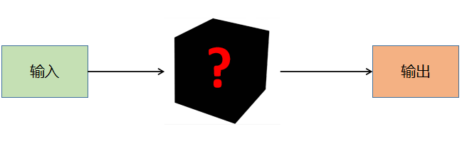
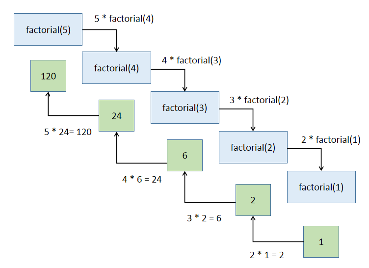
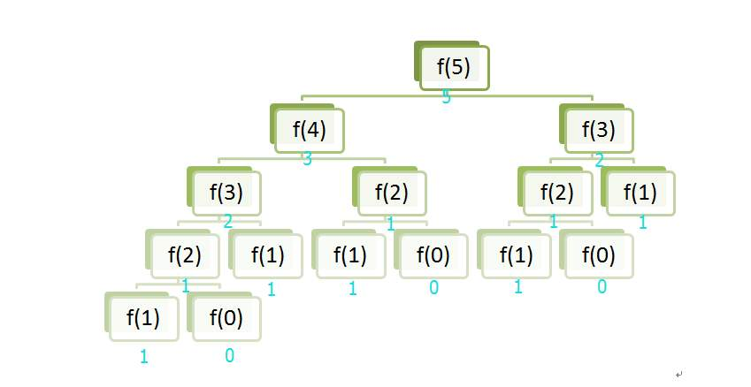

函数执行一个特定的任务，JS提供了大量内置函数，例如`alert()`用来显示警告对话框、`parseInt()`用来将字符串转换为整型等。



当调用函数时，程序控制权会转移给被调用的函数，当函数执行结束后，函数会把程序序控制权交还给其调用者。

```mermaid
graph TB
	subgraph Callee
		code2 --> code3
	end

	subgraph Caller
		code1 --> call
		call --> code5
	end
	
	call --> code2
	code3 --> call
```

函数的定义需要使用关键字`function`，函数的参数列表包括参数的类型、顺序、数量等信息，参数列表可以为空。

```js
function funcName(parameterList) {
    // code
}
```


**函数设计方法**

为什么不把所有的代码全部写在一起，还需要自定义函数呢？

使用函数有以下好处：

1. 避免代码复制，代码复制是程序质量不良的表现
2. 便于代码维护
3. 避免重复造轮子，提高开发效率

在设计函数的时候需要考虑以下的几点要素：

1. 确定函数的功能
2. 确定函数的参数
    - 是否需要参数
    - 参数个数
    - 参数类型
3. 确定函数的返回值
    - 是否需要返回值
    - 返回值类型

---

【代码】函数实现返回最大值

```js
function max(num1, num2) {
    // if(num1 > num2) {
    //     return num1;
    // } else {
    //     return num2;
    // }

    return num1 > num2 ? num1 : num2;
}

console.log(max(4, 12));
console.log(max(54, 33));
console.log(max(0, -12));
console.log(max(-999, -774));
```

> 运行结果

```
12
54
0
-774
```

---

【代码】函数实现累加和

```js
function sum(start, end) {
    var total = 0;
    for(var i = start; i <= end; i++) {
        total += i;
    }
    return total;
}

console.log("1-100的累加和 = " + sum(1, 100));
console.log("1024-2048的累加和 = " + sum(1024, 2048));
```

> 运行结果

```
1-100的累加和 = 5050
1024-2048的累加和 = 1574400
```

---

【代码】函数实现输出i行j列由自定义字符组成的图案

```js
function print_chars(row, col, c) {
    var str = "";
    for(var i = 0; i < row; i++) {
        for(var j = 0; j < col; j++) {
            str += c;
        }
        str += "\n";
    }
    console.log(str);
}

print_chars(5, 10, '?');
```

> 运行结果

```
??????????
??????????
??????????
??????????
??????????
```

---

<div style="page-break-after: always;"></div>

## 14.2 局部变量与全局变量

**局部变量（Local Varaible）**

JS的局部变量是在函数里面被声明的，这些变量的作用域在本地，也就是说这些变量只能在函数内部可用。本地变量在函数调用时被创造，在函数结束时被销毁。

在函数中，函数的每次调用就会产生一个独立的空间，在这个空间中的变量，是函数的这次运行所独有的，函数的参数也是局部变量。

---

【代码】局部变量

```js
function test(a) {
    a = 2;
    console.log("a = " + a);
}

var a = 1;
console.log("a = " + a);
test(a);
console.log("a = " + a);
```

> 运行结果

```
a = 1
a = 2
a = 1
```

---


**全局变量（Global Varaible）**

JS的全局变量就是在函数外被声明的变量，作用域为全局，所有的在页面上的脚本和函数都可以获取这些变量。全局变量在其被声明时创建，在页面被关闭时被销毁。

全局变量的优先级低于局部变量，当全局变量与局部变量重名的时候，起作用的是局部变量，全局变量会被暂时屏蔽掉。


---

【代码】全局变量

```js
var a = 1;          // 全局变量

function test() {
    var a = 2;      // 本地变量
    console.log("a = " + a);
}

test();
```

> 运行结果

```
a = 2
```

---

<div style="page-break-after: always;"></div>

## 14.3 递归

**递归（Recursion）**

要理解递归，先得理解递归（见14.3章节）。

在函数的内部，直接或者间接的调用自己的过程就叫作递归。对于一些问题，使用递归可以简洁易懂的解决问题，但是递归的缺点是性能低，占用大量系统栈空间。

递归算法很多时候可以处理一些特别复杂、难以直接解决的问题。

比如：

- 迷宫
- 汉诺塔
- 八皇后
- 排序
- 搜索

在定义递归函数时，一定要确定一个结束条件，否则会造成无限递归的情况，最终会导致栈溢出。


---

【代码】无限递归

```js
function tell_story() {
    console.log("从前有座山");
    console.log("山里有座庙");
    console.log("庙里有个老和尚和小和尚");
    console.log("老和尚对小和尚在讲故事");
    console.log("他讲的故事是：");
    tell_story();
}

tell_story();
```

> 运行结果

```
从前有座山
山里有座庙
庙里有个老和尚和小和尚
老和尚对小和尚在讲故事
他讲的故事是：
从前有座山
山里有座庙
庙里有个老和尚和小和尚
老和尚对小和尚在讲故事
他讲的故事是：
...
```

---

递归函数一般需要定义递归的出口，即结束条件，确保递归能够在适合的地方退出。

---

【代码】阶乘

```js
function factorial(n) {
    if(n == 0 || n == 1) {
        return 1;
    }
    return n * factorial(n - 1);
}

console.log("5! = " + factorial(5));
```

> 运行结果

```
5! = 120
```



---

【代码】斐波那契数列（递归）

```js
function fibonacci(n) {
    if(n == 1 || n == 2) {
        return 1;
    }
    return fibonacci(n - 2) + fibonacci(n - 1);
}

n = 7;
console.log("斐波那契数列第" + n + "位：" + fibonacci(7));
```

> 运行结果

```
斐波那契数列第7位：13
```



---

【代码】斐波那契数列（迭代）

```js
function fibonacci(n) {
    var f = new Array(n + 1);
    f[1] = f[2] = 1;
    for(var i = 3; i <= n; i++) {
        f[i] = f[i - 2] + f[i - 1];
    }
    return f[n];
}

n = 7;
console.log("斐波那契数列第" + n + "位：" + fibonacci(7));
```

> 运行结果

```
斐波那契数列第7位：13
```

---

【代码】阿克曼函数
$$
A(m, n) =
\begin{cases}
	n + 1 & m = 0 \\
	A(m-1, 1) & m > 0, n = 0 \\
	A(m-1, A(m, n-1)) & m > 0, n > 0 \\
\end{cases}
$$

```js
function A(m, n) {
    if(m == 0) {
        return n + 1;
    } else if(m > 0 && n == 0) {
        return A(m-1, 1);
    } else if(m > 0 && n > 0) {
        return A(m-1, A(m, n-1));
    }
}

console.log(A(3, 4));
```

> 运行结果

```
125
```

|  m\n  |      0      |         1         |         2         |            3            |         4         |                           n                            |
| :---: | :---------: | :---------------: | :---------------: | :---------------------: | :---------------: | :----------------------------------------------------: |
| **0** |      1      |         2         |         3         |            4            |         5         |                       $ n + 1 $                        |
| **1** |      2      |         3         |         4         |            5            |         6         |                  $ 2 + (n + 3) - 3 $                   |
| **2** |      3      |         5         |         7         |            9            |        11         |                    $ 2(n + 3) - 3 $                    |
| **3** |      5      |        13         |        29         |           61            |        125        |                   $ 2^{n + 3} - 3 $                    |
| **4** |     13      |       65533       | $ 2^{65536} - 3 $ | $ A(3, 2^{65536} - 3) $ | $ A(3, A(4, 3)) $ | $ \underbrace{2^{2^{.^{.^{.{^2}}}}}}_{n+3\ twos} - 3 $ |
| **5** |    65533    |  $ A(4, 65533) $  | $ A(4, A(5, 1)) $ |    $ A(4, A(5, 2)) $    | $ A(4, A(5, 3)) $ |                       $ \dots $                        |
| **6** | $ A(5, 1) $ | $ A(5, A(5, 1)) $ | $ A(5, A(6, 1)) $ |    $ A(5, A(6, 2)) $    | $ A(5, A(6, 3)) $ |                       $ \dots $                        |


---

【代码】汉诺塔

给定三根柱子，其中A柱子从大到小套有n个圆盘，问题是如何借助B柱子，将圆盘从A搬到C。

> 规则：
>
> - 一次只能搬动一个圆盘
> - 不能将大圆盘放在小圆盘上面


递归算法求解汉诺塔问题：

1. 将前n-1个圆盘从A柱借助于C柱搬到B柱。
2. 将最后一个圆盘直接从A柱搬到C柱。
3. 将n-1个圆盘从B柱借助于A柱搬到C柱。

```js
var move = 0;       // 移动次数

/**
 * @brief  汉诺塔算法
 * @note   把 n 个盘子从 src 借助 mid 移到 dst
 * @param  n: 层数
 * @param  src: 起点柱子
 * @param  mid: 临时柱子
 * @param  dst: 目标柱子
 */
function hanoi(n, src, mid, dst) {
    if(n == 1) {
        console.log(n + "号盘：" + src + " -> " + dst);
        move++;
    } else {
        // 把前 n-1 个盘子从 src 借助 dst 移到 mid
        hanoi(n-1, src, dst, mid);
        // 移动第 n 个盘子
        console.log(n + "号盘：" + src + " -> " + dst);
        move++;
        // 把刚才的 n-1 个盘子从 mid 借助 src 移到 dst
        hanoi(n-1, mid, src, dst);
    }
}

hanoi(4, 'A', 'B', 'C');
console.log("步数 ==> " + move);
```

> 运行结果

```
1号盘：A -> B
2号盘：A -> C
1号盘：B -> C
3号盘：A -> B
1号盘：C -> A
2号盘：C -> B
1号盘：A -> B
4号盘：A -> C
1号盘：B -> C
2号盘：B -> A
1号盘：C -> A
3号盘：B -> C
1号盘：A -> B
2号盘：A -> C
1号盘：B -> C
步数 ==> 15
```

---

<div style="page-break-after: always;"></div>

# 第15章 事件

## 15.1 事件

**事件（Event）**

JS创建动态页面时，事件是可以被JS侦测到的行为。网页中的每个元素都可以产生某些可以出发JS函数或程序的事件。例如当用户单击或者提交表单数据时，就发生一个鼠标单击事件，需要浏览器做出处理，返回给用户一个结果。

| 事件        | 说明                 |
| :---------- | -------------------- |
| onclick     | 鼠标单击事件         |
| onmouseover | 鼠标经过事件         |
| onmouseout  | 鼠标移开事件         |
| onchange    | 文本框内容改变事件   |
| onselect    | 文本框内容被选中事件 |
| onfocus     | 光标聚集             |
| onblur      | 光标离开             |
| onload      | 网页导入             |
| onunload    | 关闭网页             |

<div style="page-break-after: always;"></div>

## 15.2 鼠标单击事件

**鼠标单击事件onclick**

当在网页上单击鼠标时，就会发生该事件，同时`onclick`事件调用的程序块就会被执行，`onclick`通常与按钮一起使用。


---

【代码】onclick

```html
<!DOCTYPE html>
<html lang="en">
<head>
    <meta charset="UTF-8">
    <title>鼠标单击事件onclick</title>
    <script type="text/JavaScript">
        var cnt = 0;
        function feedback() {
            cnt++;
            console.log("我被点击了"+ cnt + "次");
        }
    </script>
</head>
<body>
    <form action="get/post">
        <input type="button" value="点击" onclick="feedback();">
    </form>
</body>
</html>
```

---

<div style="page-break-after: always;"></div>

## 15.3 鼠标经过/移开事件

**鼠标经过事件onmouseover**

当鼠标移到一个对象上时，该对象就会触发`onmouseover`事件，并执行`onmouseover`事件调用的程序。


---

【代码】onmouseover

```html
<!DOCTYPE html>
<html lang="en">
<head>
    <meta charset="UTF-8">
    <title>鼠标经过事件onmouseover</title>
    <script type="text/JavaScript">
        function feedback() {
            alert("卸载之前再想想吧...");
        }
    </script>
</head>
<body>
    <form action="get/post">
        <input type="button" value="卸载" 
            onmouseover="feedback();">
    </form>
</body>
</html>
```

---


**鼠标移开事件onmouseout**

当鼠标移开当前对象时，执行`onmouseout`事件调用的程序。

---

【代码】onmouseout

```html
<!DOCTYPE html>
<!DOCTYPE html>
<html lang="en">
<head>
    <meta charset="UTF-8">
    <title>鼠标移开事件onmouseout</title>
    <script type="text/JavaScript">
        function feedback() {
            alert("不要离开！只要输入密码，再点击登录就OK啦！");
        }
    </script>
</head>
<body>
    <form action="get/post">
        密码：<input type="password"
                onmouseout="feedback();">
        <input type="button" value="登录">
    </form>
</body>
</html>
```

---

<div style="page-break-after: always;"></div>

## 15.4 光标聚焦/失焦事件

**光标聚焦事件onfocus**

当网页中的对象获得聚点时，执行`onfocus`事件调用的程序。

---

【代码】onfocus

```html
<!DOCTYPE html>
<html lang="en">
<head>
    <meta charset="UTF-8">
    <title>光标聚焦事件onfocus</title>
    <script type="text/JavaScript">
        var flag = true;
        function feedback() {
            if(flag) {
                alert("不要填错啦！");
                flag = false;
            }
        }
    </script>
</head>
<body>
    <form action="get/post">
        密码：<input type="password"
                onfocus="feedback();">
        <input type="button" value="登录">
    </form>
</body>
</html>
```

---


**失焦事件onblur**

`onblur`事件与`onfocus`事件是相对事件，当光标离开当前获得聚焦对象的时候，就会触发`onblur`事件，同时执行被调用的程序。

---

【代码】onblur

```html
<!DOCTYPE html>
<html lang="en">
<head>
    <meta charset="UTF-8">
    <title>失焦事件onblur</title>
    <script type="text/JavaScript">
        function feedback() {
            alert("确定输对了再点登录哟！");
        }
    </script>
</head>
<body>
    <form action="get/post">
        密码：<input type="password"
                onblur="feedback();">
        <input type="button" value="登录">
    </form>
</body>
</html>
```

---

<div style="page-break-after: always;"></div>

## 15.5 内容选中/改变事件

**内容选中事件onselect**

当文本框或者文本域中的文本被选中时，触发`onselect`事件，同时调用的程序就会被执行。

---

【代码】onselect

```html
<!DOCTYPE html>
<html lang="en">
<head>
    <meta charset="UTF-8">
    <title>内容选中事件onselect</title>
    <script type="text/JavaScript">
        function feedback() {
            console.log("文本内容被选中");
        }
    </script>
</head>
<body>
    <form action="get/post">
        <textarea rows="10" cols="30" onselect="feedback();">填写个人信息，不少于20个字。</textarea>
    </form>
</body>
</html>
```

---


**内容改变事件onchange**

通过改变文本框的内容可以触发`onchange`事件，同时执行被调用的程序。

---

【代码】onchange

```html
<!DOCTYPE html>
<html lang="en">
<head>
    <meta charset="UTF-8">
    <title>内容改变事件onchange</title>
    <script type="text/JavaScript">
        function feedback() {
            console.log("文本内容被修改");
        }
    </script>
</head>
<body>
    <form action="get/post">
        <textarea rows="10" cols="30" onchange="feedback();">填写个人信息，不少于20个字。</textarea>
    </form>
</body>
</html>
```

---

<div style="page-break-after: always;"></div>

## 15.6 加载/卸载事件

**加载事件onload**

加载事件会在页面加载完成后立即发生，同时执行被调用的程序。注意，加载事件需要写在`<body>`标签内。


---

【代码】onload

```html
<!DOCTYPE html>
<html lang="en">
<head>
    <meta charset="UTF-8">
    <title>加载事件onload</title>
    <script type="text/JavaScript">
        function feedback() {
            alert("页面加载完成");
        }
    </script>
</head>
<body onload="feedback();">
    <p>Hello World!</p>
</body>
</html>
```

---


**卸载事件onunload**

当用户退出页面时（页面关闭、页面刷新等），就会触发`onunload`事件，同时执行被调用的程序。注意，不同浏览器对`onunload`事件的支持不同。

<div style="page-break-after: always;"></div>

# 第16章 对象

## 16.1 对象

**对象（Object）**

JS中的所有事物都是对象，如字符串、数值、数组、函数等，每个对象带有属性和方法。对象的属性反映了该对象的某些特定性质，如字符串的长度、图像的长宽等，对象的方法指的是能够在对象上执行的动作，如表单的提交、时间的获取等。

JS提供了多个内建对象，如`String`、`Date`、`Array`等，使用对象前需要先使用`new`关键字进行定义。

---

【代码】访问对象属性

```js
var arr = new Array(1, 2, 3, 4, 5);
console.log(arr.length);
```

> 运行结果

```
5
```

---

【代码】访问对象方法

```js
var str = "Hello World";
console.log(str.toUpperCase());
```

> 运行结果

```
HELLO WORLD
```

---

<div style="page-break-after: always;"></div>

## 16.2 Date

**Date**

Date对象可以存储任意一个日期，并且可以精确到毫秒数（$ 1 / 1000 $秒）。使用默认构造函数创建的日期对象有初始值，为当前电脑系统时间。

---

【代码】定义Date对象

```js
var date1 = new Date();
console.log(date1);

var date2 = new Date(2021, 3, 19);      //此处月份从0开始
console.log(date2);
```

> 运行结果

```
2021-03-19T05:09:47.713Z
2021-04-18T16:00:00.000Z
```

---

| 方法名称                      | 功能描述                           |
| ----------------------------- | ---------------------------------- |
| getDate() / setDate()         | 返回/设置日期                      |
| getFullYear() / setFullYear() | 返回/设置年份，用四位数表示        |
| getYear() / setYear()         | 返回/设置年份                      |
| getMonth() / setMonth()       | 返回/设置月份，月份从0开始         |
| getHours() / setHours()       | 返回/设置小时，24小时制            |
| getMinutes() / setMinutes()   | 返回/设置分钟数                    |
| getSeconds() / setSeconds()   | 返回/设置秒钟数                    |
| getTime() / setTime()         | 返回/设置时间（毫秒为单位）        |
| getDay()                      | 返回0-6的数字表示星期，0表示星期天 |

---

【代码】获取今日星期

```js
var date = new Date();
var weekday = [
    "星期天", 
    "星期一", 
    "星期二", 
    "星期三", 
    "星期四", 
    "星期五", 
    "星期六"
];
console.log("今天是" + weekday[date.getDay()]);
```

> 运行结果

```
今天是星期五
```

---

<div style="page-break-after: always;"></div>

## 16.3 String

**String**

定义`String`对象后就可以访问它的属性和方法。

---

【代码】计算字符串长度

```js
var str = "Hello World!"
console.log(str.length);
```

> 运行结果

```
12
```

---


**大小写转换**

使用String对象的`toUpperCase()`和`toLowerCase()`方法可以将字符串进行大小写字母转换。

---

【代码】大小写字母转换

```js
var str = "Hello World!"
console.log(str.toUpperCase());
console.log(str.toLowerCase());
```

> 运行结果

```
HELLO WORLD!
hello world!
```

---


**返回指定的字符**

使用`charAt()`方法可返回指定位置的字符，返回的字符是长度为1的字符串。

```js
stringObj.charAt(index);
```

字符串第一个字符的下标是`0`，最后一个字符的下标为`length - 1`，如果参数`index`不在`0`与`length - 1`之间，该方法将返回一个空字符串。

---

【代码】charAt()

```js
var str = "Hello World!"
console.log(str.charAt(6));
```

> 运行结果

```
W
```

---


**返回指定的字符串首次出现的位置**

`indexOf()`方法可以返回某个指定的字符串值在字符串中首次出现的位置。

```js
stringObj.indexOf(substring, startPos);
```

该方法将从头到尾地检索字符串，检查是否含有需检索的子串。参数`startPos`为可选参数，用于规定开始查找的位置，如果没有设置此参数将从头开始查找。如果找到了子串，在返回子串的第一次出现位置。如果要检索的字符串值没有出现，则该方法返回`-1`。

---

【代码】indexOf()

```js
var str = "Hello World!";
console.log(str.indexOf("Hell"));
console.log(str.indexOf("o", 6));
console.log(str.indexOf("JS"));
```

> 运行结果

```
0
7
-1
```

---


**字符串分割**

`split()`方法可以将字符串分割为字符串数组，并返回此数组。

```js
stringObj.split(separator, limit);
```

其中参数`separator`必选，用于指定将字符串按某个字符切割成若干个子字符串，并以数组的形式返回。参数`limit`可选，用于指定分隔的次数。

如果把空字符串作为`separator`，那么字符串的每个字符之间都会被分隔。

---

【代码】split()

```js
var str = "hello HTML hello CSS hello JavaScript";
console.log(str.split(" "));
console.log(str.split(" ", 4));
```

> 运行结果

```
["hello", "HTML", "hello", "CSS", "hello", "JavaScript"]
["hello", "HTML", "hello", "CSS"]
```

---


**提取字符串**

`substring()`方法用于提取字符串中介于两个指定下标之间的字符。

```js
stringObj.substring(startPos, stopPos);
```

该方法返回的内容是从`startPos`开始到`stopPos - 1`处的所有内容，其长度为`stopPos - startPos`。如果`startPos`和`stopPos`相等，那么返回的就是一个空串（长度为`0`的字符串）。如果`startPos`比`stopPos`大，那么该方法在提取子串之间会先交换这两个参数。

---

【代码】substring()

```js
var str = "HelloWorld";
console.log(str.substring(2, 8));
console.log(str.substring(3, 3));
console.log(str.substring(7, 3));
```

> 运行结果

```
lloWor

loWo
```

---


**提取指定数目的字符**

`substr()`方法用于从字符串中提取从`startPos`位置开始的指定数目的字符串。

```js
stringObj.substr(startPos, length);
```

如果参数`startPos`是负数，则从字符串的尾部开始算起，如果`startPos`为负数且绝对值大于字符串长度，则`startPos`会被视为`0`。

---

【代码】substr()

```js
var str = "HelloWorld";
console.log(str.substr(2, 3));
console.log(str.substr(-5, 4));
```

> 运行结果

```
llo
Worl
```

---

<div style="page-break-after: always;"></div>

## 16.4 Math

**Math**

`Math`对象提供对数据的数学计算。需要注意的是，`Math`对象是一个固有的对象，无需创建它，直接把`Math`作为对象使用就可以调用其所有属性和方法，这是它与其它对象的区别。

| 属性    | 说明                                                   |
| ------- | ------------------------------------------------------ |
| E       | 返回算术常量$ e $，即自然对数的底数（约等于$ 2.718 $） |
| LN2     | 返回$ 2 $的自然对数（约等于$ 0.693 $）                 |
| LN10    | 返回$ 10 $的自然对数（约等于$ 2.302 $）                |
| LOG2E   | 返回以$ 2 $为底$ e $的对数（约等于$ 1.442 $）          |
| LOG10E  | 返回以$ 10 $为底$ e $的对数（约等于$ 0.434 $）         |
| PI      | 返回圆周率（约等于$ 3.14159 $）                        |
| SQRT1_2 | 返回$ 2 $的平方根的倒数（约等于$ 0.707 $）             |
| SQRT2   | 返回$ 2 $的平方根（约等于$ 1.414 $）                   |


| 方法      | 描述                             |
| --------- | -------------------------------- |
| sin(x)    | 返回$ x $的正弦                  |
| cos(x)    | 返回$ x $的余弦                  |
| tan(x)    | 返回$ x $的正切                  |
| acos(x)   | 返回$ x $的反余弦值              |
| asin(x)   | 返回$ x $的反正弦值              |
| atan(x)   | 返回$ x $的反正切值              |
| ceil(x)   | 对$ x $进行上取整                |
| floor(x)  | 对$ x $进行下取整                |
| abs(x)    | 返回$ x $的绝对数                |
| exp(x)    | 返回$ e $的$ x $次幂             |
| log(x)    | 返回$ x $的自然对数（底为$ e $） |
| pow(x, y) | 返回$ x $的$ y $次幂             |
| max(x, y) | 返回$ x $和$ y $中的最大值       |
| min(x, y) | 返回$ x $和$ y $中的最小值       |
| round(x)  | 返回$ x $的四舍五入最接近的整数  |
| sqrt(x)   | 返回$ x $的平方根                |
| random()  | 返回$ 0 - 1 $之间的随机数        |

<div style="page-break-after: always;"></div>

# 第17章 浏览器对象模型BOM

## 17.1 window对象

**window对象**

·window·对象是浏览器对象模型`BOM（Browser Object Model）`的核心。

| 方法            | 描述                                           |
| --------------- | ---------------------------------------------- |
| alert()         | 显示带有一段消息和一个确认按钮的警告框         |
| prompt()        | 显示可提示用户输入的对话框                     |
| confirm()       | 显示带有一段消息以及确认按钮和取消按钮的对话框 |
| open()          | 打开一个新的浏览器窗口或查找一个已命名的窗口   |
| close()         | 关闭浏览器窗口                                 |
| print()         | 打印当前窗口的内容                             |
| focus()         | 把键盘焦点给与一个窗口                         |
| blur()          | 把键盘焦点从顶层窗口移开                       |
| moveBy()        | 可相对窗口的当前坐标把它移动指定的像素         |
| moveTo()        | 把窗口的左上角移动到一个指定的坐标             |
| resizeBy()      | 按照指定的像素调整窗口的大小                   |
| resizeTo()      | 把窗口的大小调整到指定的宽度和高度             |
| scrollBy()      | 按照指定的像素值来滚动内容                     |
| scrollTo()      | 把内容滚动到指定的坐标                         |
| setInterval()   | 每隔指定的时间执行代码                         |
| setTimeout()    | 在指定的延迟时间之后来执行代码                 |
| clearInterval() | 取消`setInterval()`的设置                      |
| clearTimeout()  | 取消`setTimeout()`的设置                       |

<div style="page-break-after: always;"></div>

## 17.2 计时器

**计时器**

在JS中，可以在设定的时间间隔之后执行代码，而不是在函数被调用后立即执行。

计时器的类型分为2种：

1. 一次性计时器：仅在指定的延迟时间之后触发一次。
2. 间隔性触发计时器：每隔一定的时间间隔就触发一次。

| 方法            | 描述                           |
| --------------- | ------------------------------ |
| setTimeout()    | 在指定的延迟时间之后来执行代码 |
| clearTimeout()  | 取消`setTimeout()`的设置       |
| setInterval()   | 每隔指定的时间执行代码         |
| clearInterval() | 取消`setInterval()`的设置      |


**setTimeout()**

`setTimeout()`计时器，在载入后延迟指定时间后，去执行一次表达式，仅执行一次。

```js
setTimeout(expr, timeout);
```

> - expr：要调用的函数或要执行的代码串。
> - timeout：在执行代码前需等待的时间，以毫秒为单位（1s = 1000ms）。

---

【代码】setTimeout()计时器

```js
//网页打开2秒后弹出提示框
setTimeout("alert('Welcome')", 2000);
```

---

`clearTimeout()`和`setTimeout()`一起使用，用于停止计时器。

```js
clearTimeout(id_of_setTimeout);
```

> id_of_setTimeout：`setTimeout()`返回的ID值，该值标识要取消的延迟执行代码块。

---

【代码】计数器

- counter.html

```html
<!DOCTYPE html>
<html lang="en">
<head>
    <meta charset="UTF-8">
    <title>计数器</title>
    <script src="counter.js"></script>
</head>
<body>
    <form action="get/post">
        <input type="text" id="num">
        <input type="button" value="stop" onclick="stopCount();">
    </form>
</body>
</html>
```

- counter.js

```js
var cnt = 0;        // 计数
var counter;        // 计数器

/**
 * 每隔1000毫秒计数加1
 */
function count() {
    document.getElementById('num').value = cnt;
    cnt++;
    counter = setTimeout(count, 1000);
}

/**
 * 停止计数器
 */
function stopCount() {
    clearTimeout(counter);
}

setTimeout(count, 1000);        // 启动计数器
```

---


**setInterval()**

`setInterval()`在执行时，从载入页面后每隔指定的时间执行代码。

```js
setInterval(expr, interval);
```

> - expr：要调用的函数或要执行的代码串。
> - interval：周期性执行或调用表达式之间的时间间隔，以毫秒为单位（1s = 1000ms）。

`clearInterval()`方法可取消由`setInterval()`设置的交互时间。

```js
clearInterval(id_of_setInterval);
```

> id_of_setInterval：`setInterval()`返回的ID值。

---

【代码】实时显示当前时间

- current_time.html

```html
<!DOCTYPE html>
<html lang="en">
<head>
    <meta charset="UTF-8">
    <title>显示当前时间</title>
    <script src="current_time.js"></script>
</head>
<body>
    <form action="get/post">
        <input type="text" id="time" size="50">
    </form>
</body>
</html>
```

- current_time.js

```js
// function clock() {
//     var date = new Date();
//     document.getElementById("time").value = date;
// }

// setInterval(clock, 1000);

// 箭头函数
setInterval(() => {
    var date = new Date();
    document.getElementById("time").value = date;
}, 1000);
```

---

<div style="page-break-after: always;"></div>

## 17.3 Screen对象

**Screen对象 **

`Screen`对象用于获取用户的屏幕信息。`window.screen`对象在编写时可以不使用`window`前缀。

```js
window.screen.属性;
```


| 属性        | 描述                                                         |
| ----------- | ------------------------------------------------------------ |
| availHeight | 窗口可以使用的屏幕高度，单位像素                             |
| availWidth  | 窗口可以使用的屏幕宽度，单位像素                             |
| colorDepth  | 用户浏览器表示的颜色位数，通常为32位（每像素的位数）         |
| pixelDepth  | 用户浏览器表示的颜色位数，通常为32位（每像素的位数），IE不支持此属性 |
| height      | 屏幕的高度，单位像素                                         |
| width       | 屏幕的宽度，单位像素                                         |

`screen.availWidth`和`screen.availHeight`属性返回访问者屏幕的宽度和高度，单位为像素，减去界面特性，比如任务栏等。不同系统的任务栏默认高度不一样，及任务栏的位置可在屏幕上下左右任何位置，所以有可能可用宽度和高度不一样。

---

【代码】屏幕信息

```html
<!DOCTYPE html>
<html lang="en">
<head>
    <meta charset="UTF-8">
    <title>屏幕信息</title>
    <script type="text/JavaScript">
        console.log("屏幕分辨率：" + screen.width + "*" + screen.height)
        console.log("屏幕可用宽高：" + screen.availWidth + "*" + screen.availHeight);
    </script>
</head>
<body>
    
</body>
</html>
```

> 运行结果

```
屏幕分辨率：1536*864
屏幕可用宽高：1536*824
```

---

<div style="page-break-after: always;"></div>

# 第18章 文档对象模型DOM

## 18.1 DOM

**DOM（Document Object Model）**

文档对象模型`DOM`定义访问和处理HTML文档的标准方法，`DOM`将HTML文档呈现为带有元素、属性和文本的树结构（结点树）。


<div style="page-break-after: always;"></div>

## 18.2 获取结点对象

**getElementById()**

`getElementById()`方法可返回拥有指定ID的第一个对象的引用。

```js
document.getElementById(elementID);
```

如果没有指定ID的元素则返回`null`，如果存在多个指定ID的元素则返回第一个。

---

【代码】定时变换颜色

- random_color.html

```html
<!DOCTYPE html>
<html lang="en">
<head>
    <meta charset="UTF-8">
    <title>随机颜色</title>
    <script src="random_color.js"></script>
</head>
<body>
    <div id="square" style="width: 100px; height: 100px"></div>
</body>
</html>
```

- random_color.js

```js
/**
 * 随机生成RGB颜色代码
 * @returns rgb颜色
 */
function randomRGB() {
    var r = Math.floor(Math.random() * 256);
    var g = Math.floor(Math.random() * 256);
    var b = Math.floor(Math.random() * 256);
    return "rgb(" + r + ", " + g + ", " + b + ")";
}

/**
 * 获取元素结点，设置背景颜色
 */
function changeColor() {
    var obj = document.getElementById("square");
    obj.style.background = randomRGB();
}

// 每隔300ms改变颜色
setInterval(function () {
    changeColor();
}, 300);
```

---


**getElementsByClassName()**

`getElementByClassName()`方法返回文档中所有指定类名的元素集合，作为`NodeList`对象。`NodeList`对象代表一个有顺序的结点列表，可以通过索引来访问列表中的结点。使用`NodeList`的`length`属性可以确定指定类名的元素个数，并循环各个元素来获取某个元素。

```js
document.getElementsByClassName(className);
```


**getElementByName()**

`getElementByName()`方法返回带有指定名称的结点对象的集合。

```js
document.getElementsByName(name);
```

与`getElementById()`方法不同的是，通过元素的`name`属性查询元素，而不是通过`id`属性。文档中的`name`属性可能不唯一，所以`getElementByName()`方法返回的是元素的数组，而不是一个元素。


**getElementsByTagName()**

`getElementsByTagName()`方法返回带有指定标签名的结点对象的集合，返回元素的顺序是它们在文档中的顺序。

```js
document.getElementsByTagName(tagName);
```

<div style="page-break-after: always;"></div>

## 18.3 结点属性

**结点属性**

`getAttribute()`方法可以通过元素结点的属性名称获取属性的值。

```js
elementNode.getAttribute(name);
```

其中，`elementNode`可以使用`getElementById()`、`getElementsByTagName()`等方法获取到元素结点，参数`name`为需要查询的元素结点的属性名称。

`setAttribute()`方法可以增加一个指定名称和值的新属性，或者把一个现有的属性设定为指定的值。

```js
elementNode.setAttribute(name, value);
```

> - name：设置的属性名。
> - value：设置的属性值。

---

【代码】设置结点属性值

- getAttribute.html

```html
<!DOCTYPE html>
<html lang="en">
<head>
    <meta charset="UTF-8">
    <title>设置结点属性</title>
    <script src="getAttribute.js"></script>
</head>
<body>
    <a class="link" href="https://www.baidu.com">百度</a>
    <a class="link" href="https://www.bilibili.com">哔哩哔哩</a>
</body>
</html>
```

- getAttribute.js

```js
window.onload = function() {
    var links = document.getElementsByClassName("link");
    for(var i = 0; i < links.length; i++) {
        console.log(links[i].getAttribute("href"));
        links[i].setAttribute("target", "_blank");
    }
};
```

> 运行结果

```
https://www.baidu.com
https://www.bilibili.com
```

---

<div style="page-break-after: always;"></div>

## 18.4 结点操作

**结点操作**

- `createElement()`：创建结点元素，此方法可返回一个`Element`对象。要与`appendChild()`或`insertBefore()`方法联合使用，将元素显示在页面中。

```js
document.createElement(tagName);
```

- `appendChild()`：在指定结点的最后一个子结点列表之后添加一个新的子结点。

```js
elementNode.appendChild(newNode);
```

- `insertBefore()`：在已有的子结点前插入一个新的子结点。

```js
elementNode.insertBefore(newNode, node);
```

- `removeChild()`：从子结点列表中删除某个结点，如删除成功返回被删除的结点，如失败则返回`null`。

```js
elementNode.removeChild(node);
```

- `replaceChild()`：实现子结点的替换，返回被替换对象的引用。当`oldNode`被替换时，所有与之相关的属性内容都将被移出。

```js
elementNode.replaceChild(newNode, oldNode);
```

