<center><h1>HTML/CSS/JavaScript</h1></center>

<div style="border-bottom: none;"><center><h3>目录</h3></center></div>

[TOC]

<div style="page-break-after: always;"></div>

# 第1章 前后端

## 1.1 前端/后端工程师

**前端工程师（Front-End Engineer）**

前端工程师互联网时代软件产品研发中不可缺少的一种专业研发角色。前端是一个相对比较新的行业，大约从2005年开始，正式的前端工程师角色被行业所认可。到了2010年，互联网开始全面进入移动时代，前端工程师的地位也越来越重要。

现在一些后端开发工作也可以由前端工程师来完成。最初所有的开发工作都是由后端工程师完成的，但是随着业务越来越繁杂、工作量过大，后端工程师们不堪重负，于是将可视化和部分交互功能的开发剥离出来，形成了前端开发。

前端工程师主要负责的工作就是使用`HTML`、`CSS`、`JavaScript`等专业技能和工具将产品UI设计稿实现成网站产品。涵盖用户PC端和移动端网页，处理视觉和交互问题。

广义上讲，所有用户终端产品，只要是与视觉和交互有关的部分都是前端工程师的专业领域。产品从前期开发到后期的维护、更新、升级都需要前端工程师来完成。


**后端工程师（Back-End Engineer）**

后端工程师主要负责服务器的数据逻辑和业务逻辑等，主要研究怎么把数据更好地传输给前端工程师。

如果一个人除了完成前端开发和后端开发工作以外，从产品设计到项目开发，再到后期运维都是同一个人，甚至可能还要负责UI、配动画、写文档等，那么就被称为全栈工程师（Full Stack Engineer）。


<div style="page-break-after: always;"></div>

## 1.2 前端技术

**应用领域**

前端技术可以被应用在一系列领域中：

- 网页网站
- APP、微信小程序
- 移动端小游戏
- 炫酷的特效
- 大数据可视化
- VR虚拟现实


**必备技能**

前端工程师需要具备大量必要的技能，其中前端三大基础语言为`HTML`、`CSS`、`JavaScript`，除此之外还需要学习`jQuery`、`网络`、`CSS3`、`H5`、`es6`、`webpack4.0`、`git`、`小程序`、`设计模式`、`VUE`、`VUEX`、`VUE源码`、`React`、`Node.js`、`Mongo DB`数据库等内容。


<div style="page-break-after: always;"></div>

## 1.3 结构层/表现层/行为层

**结构层 / 表现层 / 行为层**

- 结构层`HTML（HyperText Markup Language）`：一个超文本标记语言，负责描绘出网页内容的架构。
- 表示层`CSS（Cascading Style Sheets）`：层叠样式表，负责如何显示结构层的有关内容。
- 行为层`JavaScript`：目前在Web上使用的最主要的客户端脚本语言，是Web脚本语言的一个标准，可以对结构层和表现层的内容随意进行更改。

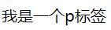


**代码注释**

在`HTML`、`CSS`、`JavaScript`中代码的注释是不一样的。

- HTML

```html
<!-- 注释内容 -->
```

- CSS

```css
/* 注释内容 */
```

- JavaScript

```js
// 注释内容
/* 注释内容 */
```

<div style="page-break-after: always;"></div>

# 第2章 HTML5介绍

## 2.1 Hello World!

**Hello World!**

问候一下世界，制作人生中的第一个HTML网页吧。

---

【代码】Hello World!

```html
<!DOCTYPE html>
<html lang="en">
<head>
    <meta charset="UTF-8">
    <title>Hello World!</title>
</head>
<body>
    Hello World!
</body>
</html>
```

<div style="page-break-after: always;"></div>

## 2.2 佛靠金装，人靠衣装——HTML和CSS的关系

**HTML和CSS的关系**

先来看一下单纯的HTML标签长什么样。

```html
<p>我是一个p标签</p>
```


再来看一下经过CSS修饰过后的HTML标签：

```css
p {
    color: red;
    border: 1px solid red;
    width: 140px;
    height: 40px;
}
```


CSS是用来修饰HTML样式的。虽然HTML本身是有一些默认样式，但如果想改变HTML标签的样式，就需要借助CSS。

HTML + CSS构成了网页的基本页面结构和样式。

---

【代码】为"Hello World!"添加样式

```html
<!DOCTYPE html>
<html lang="en">
<head>
    <meta charset="UTF-8">
    <title>添加样式</title>
    <style type="text/css">
        p {
            font-size: 12px;
            color: #930;
            text-align: center;
        }
    </style>
</head>
<body>
    <p>Hello World!</p>
</body>
</html>
```

---

<div style="page-break-after: always;"></div>

## 2.3 标签语法

**标签语法**

HTML中标签的语法有以下几点：

1. 标签（tag）是由英文尖括号`<`和`>`括起来的，如`<html>`就是一个标签。
2. HTML中的标签一般都是成对出现的，分开始标签和结束标签。结束标签比开始标签多了一个`/`。例如：

```html
<p></p>
<div></div>
<span></span>
```

3. 标签与标签之间是可以嵌套的，但先后顺序必须保持一致。如，`<div>`里嵌套`<p>`，那么`</p>`必须放在`</div>`的前面。

```html
<div><p>Hello World!</p></div>
```

4. HTML标签不区分大小写，如`<h1>`和`<H1>`是一样的，但建议小写，因为大部分程序员都已小写为准。


<div style="page-break-after: always;"></div>

## 2.4 HTML5文档结构

**HTML文档结构**

---

【代码】HTML文档结构

```html
<!DOCTYPE html>
<html lang="en">
<head>
    <meta charset="UTF-8">
    <title>HTML文档结构</title>
</head>
<body>
    
</body>
</html>
```

---

- `<!DOCTYPE html>`：文档类型声明，表示该文件为`HTML5`文件。`<!DOCTYPE>`声明必须是`HTML`文档的第一行，位于`<html>`标签之前。
- `<html></html>`标签对：`<html>`标签用来标识HTML文档的开始，`</html>`标签位于HTML文档的最后面，用来标识HTML文档的结束。这两个标签对成对存在，中间的部分是文档的头部和主题。
- ` <head></head>`标签对：标签包含有关HTML文档的信息，可以包含一些辅助性标签。如`<title></title>`、`<link />`、`<meta />`、`<style></style>`、`<script></script`>等，浏览器除了会在标题栏显示`<title>`元素的内容外，不会向用户显示`head`元素内的其他任何内容。
- `<body></body>`标签对：HTML文档的主体部分，在此标签中可以包含`<p>`、`<h1>`、`<br>`等众多标签。`<body>`标签出现在`</head>`标签之后，且必须在闭标签`</html>`之前闭合。

<div style="page-break-after: always;"></div>

## 2.5 小哥，做头吗？——head标签

**head标签**

文档的头部描述了文档的各种属性和信息，包括文档的标题等，绝大多数文档头部包含的数据都不会真正作为内容显示给读者。

`head`标签为双标签`<head></head>`，表示头部标签，通常用来嵌套`meta`、`title`、`style`等标签。

- `<title>`标签：在`<title>`和`</title>`标签之间的文字内容是网页的标题信息，它会出现在浏览器的标题栏中。网页的title标签用于告诉用户和搜索引擎这个网页的主要内容是什么，搜索引擎可以通过网页标题，迅速的判断出网页的主题。每个网页的内容都是不同的，每个网页都应该有一个独一无二的title。
- `<meta charset="UTF-8">`：设置当前文件字符编码。
- `<style>`标签：设置当前文件样式。

<div style="page-break-after: always;"></div>

## 2.6 你就是馋人家的身子！——body标签

**body标签**

在网页上要展示出来的页面内容一定要放在`<body>`标签中。

---

【代码】body标签

```html
<!DOCTYPE html>
<html lang="en">
<head>
    <meta charset="UTF-8">
    <title>body标签</title>
</head>
<body>
    <!-- 标题标签 -->
    <h1>HTML简介</h1>
    <!-- 段落标签 -->
    <p>HTML的全称为超文本标记语言，是一种标记语言。它包括一系列标签．通过这些标签可以将网络上的文档格式统一，使分散的Internet资源连接为一个逻辑整体。HTML文本是由HTML命令组成的描述性文本，HTML命令可以说明文字，图形、动画、声音、表格、链接等。</p>
    <!-- 段落标签 -->
    <p>超文本是一种组织信息的方式，它通过超级链接方法将文本中的文字、图表与其他信息媒体相关联。这些相互关联的信息媒体可能在同一文本中，也可能是其他文件，或是地理位置相距遥远的某台计算机上的文件。这种组织信息方式将分布在不同位置的信息资源用随机方式进行连接，为人们查找，检索信息提供方便。</p>
</body>
</html>
```

---

<div style="page-break-after: always;"></div>

# 第3章 语义化标签

## 3.1 语义化

**语义化（Semantic）**

学习HTML标签需要注意标签的用途和标签在浏览器中的默认样式。

语义化，通俗的讲就是明白每个标签的用途，即在什么情况下使用此标签合理。比如，网页上文章的标题可以用标题标签、各个栏目的名称也可以使用标题标签、文章内容的段落就得放在段落标签中。

语义化可以带来一些好处：

- 更容易被搜索引擎收录
- 更容易让屏幕阅读器读出网页内容


<div style="page-break-after: always;"></div>

## 3.2 开始我们的第一段对话吧——p标签

**p标签**

如果想在网页上显示文章，就需要使用<p>标签了，把文章的段落放到`<p>`标签中。

```html
<p>段落文本</p>
```

注意一段文字一个`<p>`标签，如在一篇文章中有三段文字，就要分别放到三个`<p>`标签中。

---

【代码】p标签

```html
<!DOCTYPE HTML>
<html lang="en">
<head>
    <meta charset="UTF-8">
    <title>p标签</title>
</head>
<body>
    <p>所有主流浏览器都支持p标签。</p>
    <p>p标签定义段落。</p>
    <p>p元素会自动在其前后创建一些空白。浏览器会自动添加这些空间，您也可以在样式表中规定。</p>
</body>
</html>
```

---

`<p>`标签的默认样式，在段前段后都会有空白，如果不喜欢这个空白，可以用`CSS`样式来删除或改变它。

<div style="page-break-after: always;"></div>

## 3.3 span标签

**span标签**

`<span>`标签是没有语义的，它的作用就是为了设置单独的样式用的。

```html
<span>文本</span>
```

如果现在想把一段中某些字设置成蓝色，这种情况下就可以用到`<span>`标签了。

---

【代码】span标签

```html
<!DOCTYPE HTML>
<html lang="en">
<head>
    <meta charset="UTF-8">
    <title>span标签</title>
    <style type="text/css">
        span {
            color: blue;
        }
    </style>
</head>
<body>
    <p>莫里亚蒂有份包裹指明要交给夏洛克，乔恩作为夏洛克指定继承人，自然包裹也就应交给乔恩。如何处置这个包裹，让乔恩左右为难。思来想去，还是趁着夜色赶到墓地，敲碎了夏洛克坟前的墓碑。这是乔恩与夏洛克商定的暗号，只有在<span>生命攸关</span>的时候才能使用。</p>
</body>
</html>
```

---

<div style="page-break-after: always;"></div>

## 3.4 做个标题党——hx标签

**hx标签**

文章的段落用`<p>`标签，那么文章的标题可以使用标题标签。标题标签一共有6个，`<h1>`、`<h2>`、`<h3>`、`<h4>`、`<h5>`、`<h6>`分别为一级标题、二级标题、三级标题、四级标题、五级标题、六级标题，并且依据重要性递减，`<h1>`是最高的等级。

```html
<h1>标题文本</h1>
<h2>标题文本</h2>
<h3>标题文本</h3>
<h4>标题文本</h4>
<h5>标题文本</h5>
<h6>标题文本</h6>
```

网页上的各个栏目标题也可使用标题标签。因为`<h1>`标签在网页中比较重要，一般`<h1>`标签被用在网站名称上。

标题标签的样式都会加粗，`<h1>`标签字号最大，`<h2>`标签字号相对`<h1>`要小，以此类推`<h6>`标签的字号最小。

---

【代码】hx标签

```html
<!DOCTYPE html>
<html lang="en">
<head>
    <meta charset="UTF-8">
    <title>h1-h6标题标签</title>
</head>
<body>
    <h1>一级标签</h1>
    <h2>二级标签</h2>
    <h3>三级标签</h3>
    <h4>四级标签</h4>
    <h5>五级标签</h5>
    <h6>六级标签</h6>
</body>
</html>
```

---

<div style="page-break-after: always;"></div>

## 3.5 div标签

**div标签**

在网页制作过程过中，可以把一些独立的逻辑部分划分出来，放在一个`<div>`标签中，这个`<div>`标签的作用就相当于一个容器。

```html
<div></div>
```

逻辑部分是页面上相互关联的一组元素，如网页中的独立的栏目版块，就是一个典型的逻辑部分。如下图所示，图中用红色边框标出的部分就是一个逻辑部分，就可以使用`<div>`标签作为容器。

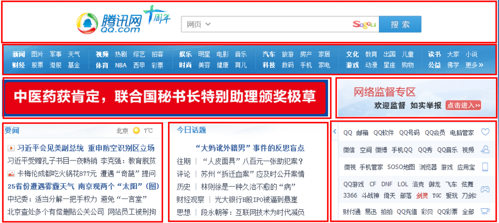

---

【代码】div标签

```html
 <!DOCTYPE html>
<html lang="en">
<head>
    <meta charset="UTF-8">
    <title>div标签</title>
</head>
<body>
    <div>
    <h2>热门课程排行榜</h2>
        <ol>
            <li>前端开发面试心法</li>
            <li>零基础学习HTML</li>
            <li>JavaScript全攻略</li>
        </ol>
    </div>

    <div>
        <h2>最新课程排行</h2>
        <ol>
            <li>版本管理工具介绍—Git篇</li>
            <li>Canvas绘图详解</li>
            <li>QQ5.0侧滑菜单</li>
        </ol>
    </div>
</body>
</html>
```

---

<div style="page-break-after: always;"></div>

## 3.6 写代码都不换行吗？——br标签

**br标签**

在HTML代码中输入回车、空格都是没有作用的，在HTML中是忽略回车和空格的，输入再多的回车和空格也是现实不出来的。如果需要在HTML文本中输入回车换行，就必须使用`<br />`标签。在需要加回车换行的地方加入`<br / >`，`<br />`标签的作用相当于Word文档中的回车。

`<br />`标签是一个单标签，没有HTML内容的标签就是单标签。单标签只需要写一个开始标签，这样的标签有`<br />`、`<hr />`和``。

---

【代码】br标签

```html
<!DOCTYPE html>
<html lang="en">
<head>
    <meta charset="UTF-8">
    <title>br标签</title>
</head>
<body>
    <h2>《望庐山瀑布》</h2>
    <p>唐·李白</p>
    <p>
        日照香炉生紫烟，<br/>
        遥看瀑布挂前川。<br/>
        飞流直下三千尺，<br/>
        疑是银河落九天。
    </p>
</body>
</html>
```

---

<div style="page-break-after: always;"></div>

## 3.7 再加点空格呢？——特殊字符 

**特殊字符**

在HTML代码中输入空格、回车都是没有作用的，输出多个空格只会显示`1`个空格。如果需要输入空格，必须使用特殊字符`&nbsp;`。

---

【代码】使用特殊字符输出空格

```html
<!DOCTYPE html>
<html lang="en">
<head>
    <meta charset="UTF-8">
    <title>空格</title>
</head>
<body>
    <h2>新闻纵览</h2>
    来源：xxx&nbsp;&nbsp;&nbsp;&nbsp;&nbsp;作者：xxx
</body>
</html>
```

---

<div style="page-break-after: always;"></div>

## 3.8 再来个水平分割线——hr标签

**hr标签**

在信息展示时，有时会需要加一些用于分隔的横线，这样会使文章看起来整齐些。

`<hr />`标签和`<br />`标签一样也是一个单标签，所以只有一个开始标签，没有结束标签。

`<hr />`标签在浏览器中的默认样式线条比较粗，颜色为灰色。有些人觉得这种样式不美观，这些在样式可以通过CSS进行修改。

---

【代码】分割两段文字

```html
<!DOCTYPE html>
<html lang="en">
<head>
    <meta charset="UTF-8">
    <title>hr标签</title>
</head>
<body>
    <h2>第1集</h2>
    <p>深夜，一道黑影潜入贝克街221B。坐在暗处的夏洛克已等候多时，正等着贝尔纳多自投罗网。贝尔纳多的目标是壁炉架上的半身像，摔到地上，从碎片中取出一个用旧布包裹好的东西。打开旧布，露出发着幽光的波吉亚黑珍珠。</p>
    <hr/>
    <h2>第2集</h2>
    <p>葛雷森警监仍昏迷不醒，需要持续输血。医生认为有内出血情况，需要开刀确定出血点。马库斯在警局内询问报案人特里梅因，想了解他发现警监时的详细情况，但并没有取得太多线索。马库斯一抬头，看到了乔恩。因夏洛克不能回美国，所以只有乔恩赶来参与调查。</p>
</body>
</html>
```

---

<div style="page-break-after: always;"></div>

# 第4章 列表、图片、链接

## 4.1 有序列表

**有序列表（Ordered List）**

如果想在网页中展示有前后顺序的信息列表，如热度排行榜等，这类信息展示可以使用`<ol>-<li>`标签来实现有序列表。

```html
<ol>
    <li>信息</li>
    <li>信息</li>
</ol>
```


---

【代码】有序列表

```html
<!DOCTYPE html>
<html lang="en">
<head>
    <meta charset="UTF-8">
    <title>有序列表</title>
</head>
<body>
    <h3>2020年7月编程语言排行榜</h3>
    <ol>
        <li>C</li>
        <li>Java</li>
        <li>Python</li>
        <li>C++</li>
        <li>C#</li>
    </ol>
</body>
</html>
```

---


**序号类型**

`<ol>-<li>`在网页中显示的默认样式一般为每项`<li>`前都自带一个序号，序号默认从`1`开始。通过修改`<ol>`标签的`type`属性，也能对序号进行修改。

`<ol>`标签的`type`属性有5个值：

1. 默认为数字序号：`type="1"`。
2. 小写字母序号：`type="a"`。
3. 大写字母序号：`type="A"`。
4. 小写罗马数字序号：`type="i"`。
5. 大写罗马数字序号：`type="I"`。

`<ol>`标签中设置`start`属性，可以指定开始序号。

`<ol>`标签中设置`reversed="reversed"`属性，可以将列表序号降序排序。

<div style="page-break-after: always;"></div>

## 4.2 无序列表

**无序列表（Unordered List）**

网页上也有很多信息是无需按照先后次序排列的，如新闻列表、图片列表等，这类信息展示可以使用`<ul>-<li>`标签来实现无序列表。

```html
<ul>
    <li>信息</li>
    <li>信息</li>
</ul>
```

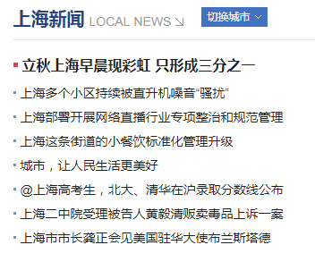


`<ul>-<li>`标签在网页中显示的默认样式一般为每项`<li>`前都自带一个圆点。通过修改`<ul>`标签的`type`属性，也能对前面的符号进行修改。

`<ul>`标签的`type`属性有2个值：

1. 默认为实心小圆点：`type="disc"`。
2. 实心正方形：`type="square"`。

---

【代码】无序列表

```html
<!DOCTYPE html>
<html lang="en">
<head>
    <meta charset="UTF-8">
    <title>无序列表</title>
</head>
<body>
    <h3>前端三剑客</h3>
    <ul>
        <li>HTML</li>
        <li>CSS</li>
        <li>JS</li>
    </ol>
</body>
</html>
```

---

淘宝网的导航栏就是利用`<ul>-<li>`的父子结构进行实现的。

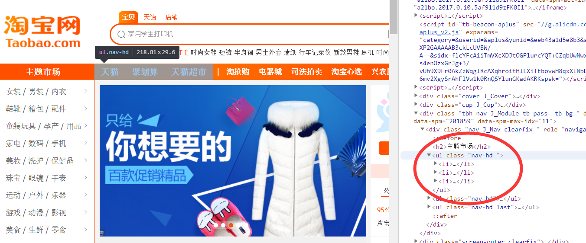

---

【代码】淘宝导航栏

```html
<!DOCTYPE html>
<html lang="en">
<head>
    <meta charset="UTF-8">
    <title>淘宝</title>
    <style type="text/css">
        ul {
            list-style: none;   /* 无序列表前面不带点 */
        }

        li {
            float: left;
            margin: 20px;
            padding: 5px;
            color: #000;
        }

        li:hover {
            background-color: #f40;     /* 淘宝红 */
            color: #fff;
            border-radius: 15px;
            cursor: pointer;
        }
    </style>
</head>
<body>
    <ul>
        <li>天猫</li>
        <li>聚划算</li>
        <li>天猫超市</li>
    </ul>
</body>
</html>
```

---

<div style="page-break-after: always;"></div>

## 4.3 不发一张自拍吗？——img标签

**img标签**

在网页的制作中为使网页炫丽美观，肯定是缺少不了图片，``标签用于插入图片。

```html

```

> - `src`属性用于标识图像的资源地址，资源地址可以来源于网上的URL，也可以来源于本地。
> - `alt`属性指定图像的描述性文本，当图像下载不成功时，可看到该属性指定的文本。
> - `title`属性提供当鼠标停留在图片时显示的文本。

---

【代码】img标签

```html
<!DOCTYPE html>
<html lang="en">
<head>
    <meta charset="UTF-8">
    <title>img标签</title>
</head>
<body>
    
</body>
</html>
```

---

<div style="page-break-after: always;"></div>

## 4.4 百度一下，你就知道——a标签

**a标签**

使用`<a>`标签可实现超链接，它在网页制作中可以说是无处不在，只要有链接的地方，就会有这个标签。

```html
<a href="目标网址" title="鼠标停留显示的文本">链接显示的文本</a>
```

`<a>`标签中`title`属性提供的功能是当鼠标停留在链接文字时显示这个属性的文本内容，这个属性在实际网页开发中作用很大，主要方便搜索引擎了解链接地址的内容（语义化更友好）。

---

【代码】a标签

```html
<!DOCTYPE html>
<html lang="en">
<head>
    <meta charset="UTF-8">
    <title>a标签</title>
</head>
<body>
    <a href="http://www.baidu.com" title="点击跳转百度">
        百度一下，你就知道
    </a>
</body>
</html>
```

只要为文本加入`<a>`标签后，文字的颜色就会自动变为蓝色，被点击过的文本颜色会变为紫色，通过CSS样式可以对文字的颜色进行修改。

`<a>`标签中还是一个`target`属性，默认值为`_self`,表示在同页面中打开被链接的文档。如果需要在新窗口打开被链接的文档，需要将`target`属性的值设置为`_blank`。


**锚点（Anchor）**

`<a>`标签最初的功能是记录锚点（记录位置），通过`<a>`标签回到那个位置去。

---

【代码】锚点

```html
<!DOCTYPE html>
<html lang="en">
<head>
    <meta charset="UTF-8">
    <title>锚点</title>
</head>
<body>
    <div id="div1" style="width: 100px; height: 100px; background-color: red;"></div>
    <div id="div2" style="width: 100px; height: 100px; background-color: blue;"></div>
    <br><br><br><br><br><br><br><br><br><br><br><br><br><br><br><br><br><br><br><br><br><br><br><br><br><br><br><br><br><br><br><br><br><br><br><br><br><br><br><br><br><br><br><br><br><br><br><br><br><br>
    <a href="#div1">跳转到div1</a>
    <a href="#div2">跳转到div2</a>
</body>
</html>
```

`<a>`标签作为锚点的应用场景也很多，比如目录跳转。

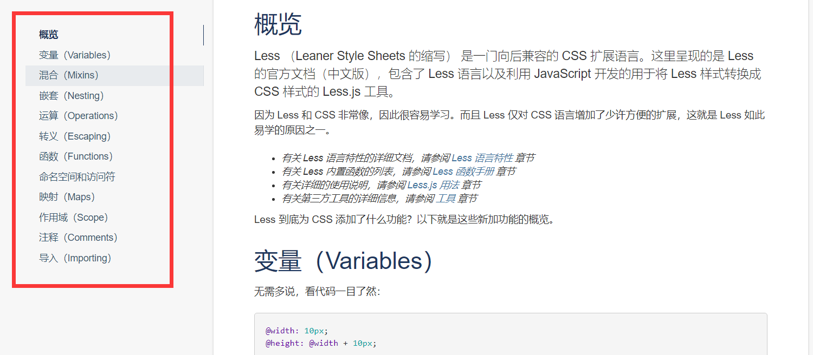


**协议限定符**

`<a>`标签还能作为协议限定符，在点击链接时会强制执行JavaScript代码。

---

【代码】协议限定符

```html
<!DOCTYPE html>
<html lang="en">
<head>
    <meta charset="UTF-8">
    <title>访问限定符</title>
</head>
<body>
    <a href="JavaScript: while(1){alert('嘿嘿');}">点我</a>
</body>
</html>
```

---

<div style="page-break-after: always;"></div>

# 第5章 表格、表单

## 5.1 表格标签

**table标签**

有时候需要在网页中添加一些表格数据，如企业员工通讯录等。


创建表格主要包含5个元素：

1. `<caption>`标签：定义表格的标题。
2. `<table>`标签：整个表格以`<table>`标记开始、`</table>`标记结束，`<table>`标签在没有添加`border`属性之前，在浏览器中显示是没有表格线的。
3. `<tr>`标签：表格的一行，有几对`<tr>`表格就有几行，`<tr>`标签里只能放`<th>`或者`<td>`标签。
4. `<th>`标签：表格头部的一个单元格，会加粗居中显示。
5. `<td>`标签：表格的一个单元格，有几对`<td>`一行中就有几列。

---

【代码】企业员工通讯录

```html
<!DOCTYPE html>
<html lang="en">
<head>
    <meta charset="UTF-8">
    <title>企业员工通讯录</title>
</head>
<body>
    <h3>企业员工通讯录</h3>
    <hr/>

    <!-- 表格标签 border属性代表给表格加上边框 -->
    <table border="1">
        <!-- 表格标题 -->
        <caption>企业员工通讯录</caption>
        <!-- tr代表一行 -->
        <tr>
            <!-- th代表表格头部的一个单元格 -->
            <th>姓名</th>
            <th>电话</th>
            <th>电子邮件</th>
            <th>职务</th>
        </tr>
        <tr>
            <!-- td代表一个单元格 -->
            <td>张三</td>
            <td>18278900988</td>
            <td>zhangsan@163.com</td>
            <td>研发工程师</td>
        </tr>
        <tr>
            <td>王二</td>
            <td>16589012689</td>
            <td>wanger@163.com</td>
            <td>研发经理</td>
        </tr>
        <tr>
            <td>李四</td>
            <td>17230019065</td>
            <td>lisi@163.com</td>
            <td>研发工程师</td>
        </tr>
    </table>
</body>
</html>
```

---

<div style="page-break-after: always;"></div>

## 5.2 与用户交互——form标签

**form标签**

使用HTML表单（form）可以实现网站与用户的交互，表单可以把浏览者输入的数据传送到服务器端，这样服务器端程序就可以处理表单传过来的数据。

```html
<form method="传送方式" action="服务器文件">表单内容</form>
```

`<form>`标签是成对出现的，以`<form>`开始、`</form>`结束。`method`属性表示数据传送的方式，包括`get`和`post`两种方式，`get`和`post`的区别属于后端程序员需要考虑的问题，完全取决于后端人员要求什么方式进行传输。`action`属性表示浏览者输入的数据被传送到的地方，比如一个PHP页面。

所有的表单控件（文本框、文本域、按钮、单选框、复选框等）都必须放在`<form>`和`</form>`标签之间，否则用户输入的信息无法提交到服务器上。

<div style="page-break-after: always;"></div>

## 5.3 先来填用户名和密码——文本、密码输入框

**文本、密码输入框**

当用户需要在表单中输入字母、数字等内容时，就需要使用到文本输入框，文本框也可转化为密码输入框。

```html
<form>
    <input type="text/password" name="名称" value="文本" />
</form>
```

> - `type="text"`：输入框为文本输入框。
> - `type="password"`：输入框为密码输入框。
> - `name`属性：为文本框命名，以备后台程序使用。
> - `value`属性：为文本输入框设置默认值，一般起提示作用。


**给点提示呗——placeholder属性**

有时候需要提示用户输入框需要输入的内容，这时候就需要使用`<input>`标签中的占位符`placeholder`属性。

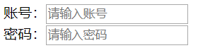

`placeholder`属性的值可以根据情况合理填写，当输入框输入内容时，占位符内容消失，当输入框无内容时，占位符内容显示。注意，占位符内容不是输入框真正的内容。


**重置按钮**

当用户需要重置表单信息到初始状态时，比如输入“账号”或“密码”有误，就可以使用重置按钮使输入框恢复到初始状态。通过设置`<input>`标签中`type`属性为`reset`即可实现重置按钮。


**提交按钮**

当用户需要提交表单信息到服务器时，需要用到提交按钮。通过设置`<input>`标签中`type`属性为`submit`即可实现提交按钮。表单信息会被发送给后端，在数据库对比账户和密码信息。

---

【代码】登录功能

```html
<!DOCTYPE html>
<html lang="en">
<head>
    <meta charset="UTF-8">
    <title>登录</title>
</head>
<body>
    <form action="get/post">
        账号：<input type="text" placeholder="请输入账号" name="username">
        <br/>
        密码：<input type="password" placeholder="请输入密码" name="password">
        <br/>
        <input type="submit">
        <input type="reset">
    </form>
</body>
</html>
```

---

<div style="page-break-after: always;"></div>

## 5.4 数字、网址、邮箱输入框

**数字输入框**

将`<input>`标签的`type`属性设置为`number`，则表示该输入框的类型为数字。数字框只能输入数字，输入其它字符无效。数字框最右侧会有一个加减符号，可以调整输入数字的大小，不同浏览器表现不一致。


**网址输入框**

将`<input>`标签的`type`属性设置为`url`，则表示该输入框的类型为网址。网址输入框的必须以`http://`或`https://`开头，且后面必须有内容，否则表单提交的时候会报错误提示。


**邮箱输入框**

将`<input>`标签的`type`属性设置为`email`，则表示该输入框的类型为邮箱。邮箱输入框的值必须包含`@`，并且之后必须有内容，否则会报错误提示。

---

【代码】提交个人信息

```html
<!DOCTYPE html>
<html lang="en">
<head>
    <meta charset="UTF-8">
    <title>个人信息</title>
</head>
<body>
    <form action="get/post">
        姓名：<input type="text" name="name"><br/>
        年龄：<input type="number" name="age"><br/>
        主页：<input type="url" name="webpage"><br/>
        邮箱：<input type="email" name="email"><br/>
        <input type="submit">
        <input type="reset">
    </form>
</body>
</html>
```

---

<div style="page-break-after: always;"></div>

## 5.5 文本域

**文本域**

当用户需要在表单中输入大段文字时，就需要用到文本输入域。`<textarea>`标签中也可以设置`placeholder`属性来显示提示信息。

```html
<textarea rows="行数" cols="列数">文本</textarea>	
```

> - `rows`属性：多行输入域的行数，可以用CSS样式的height代替。
> - `cols`属性：多行输入域的列数，可以用CSS样式的width代替。

---

【代码】文本域

```html
<!DOCTYPE html>
<html lang="en">
<head>
    <meta charset="UTF-8">
    <title>文本域</title>
</head>
<body>
    <form action="get/post">
        <textarea cols="30" rows="10" placeholder="请输入..."></textarea>
    </form>
</body>
</html>
```

---

<div style="page-break-after: always;"></div>

## 5.6 label标签

**label标签**

`<label>`标签不会向用户呈现任何特殊特效，它的作用是为鼠标用户改进了可用性。如果在`<label>`标签内点击文本，就会触发此控件。也就是说，当用户单击选中该`<label>`标签时，浏览器就会自动将焦点转到和标签相关的表单控件上。

```html
<label for="控件id名称">
```

注意，`<label>`标签的`for`属性的值必须要与相关空间的`id`属性值相同。

---

【代码】label标签

```html
<!DOCTYPE html>
<html lang="en">
<head>
    <meta charset="UTF-8">
    <title>label标签</title>
</head>
<body>
    <form action="get/post">
        <label for="username">用户名：</label>
        <input type="text" id="username">
    </form>
</body>
</html>
```

---

<div style="page-break-after: always;"></div>

## 5.7 单选框、复选框

**单选框、复选框**

在使用表单设计调查表时，为了减少用户的操作，使用选择框是一个好主意。HTML中有两种选择框，即单选框和复选框，两者的区别是单选框中的选项用户只能选择一项，而复选框中用户可以任意选择多项，甚至全选。

```html
<input type="radio/checkbox" name="名称" value="值" checked="checked">
```

> - `type="radio"`：单选框。
> - `type="checkbox"`：复选框。
> - `name`属性：为控件命名，具有相同名称的选择框属于同一组。
> - `checked`属性：设置默认选中的值。

在网页开发中，往往需要优化用户体验。一个好的产品有3个特点：解决刚需的问题、用户体验、用户黏性（产品定位）。用户体验就是养成用户的懒习惯，减少用户操作，能不让用户操作就不让用户操作，节省用户时间，用户不动手就会觉得方便。例如一个选择性别的单选框，概率上看，假设有100个人，50男50女，使用默认选项，可以节省一半人的操作。

---

【代码】单选框/复选框

```html
<!DOCTYPE html>
<html lang="en">
<head>
    <meta charset="UTF-8">
    <title>单选框/复选框</title>
</head>
<body>
    <form action="get/post">
        1. 您是否喜欢运动？
        <input type="radio" name="sport" checked="checked">是
        <input type="radio" name="sport">否
        2. 您喜欢的运动是？
        <input type="checkbox" name="sport_item">跑步
        <input type="checkbox" name="sport_item">篮球
        <input type="checkbox" name="sport_item">羽毛球
    </form>
</body>
</html>
```

---

<div style="page-break-after: always;"></div>

## 5.8 下拉列表

**下拉列表**

下拉列表在网页中也常会用到，它可以有效的节省网页空间。下拉列表既可以单选也可以多选。

```html
<select>
        <option value="值">选项</option>
        <option value="值">选项</option>
</select>
```

> - `value`属性：向服务器提交的值，而双标签中间的内容才是显示的值。
> - `selected`属性：设置`selected="selected"`表示该选项被默认选中。

---

【代码】下拉列表

```html
<!DOCTYPE html>
<html lang="en">
<head>
    <meta charset="UTF-8">
    <title>下拉列表</title>
</head>
<body>
    <!DOCTYPE html>
<html lang="en">
<head>
    <form action="get/post">
        <select>
            <option value="male" selected="selected">男</option>
            <option value="female">女</option>
        </select>
    </form>
</body>
</html>
```

---

<div style="page-break-after: always;"></div>

# 第6章 CSS3介绍

## 6.1 给HTML打扮——CSS样式

**层叠样式表（CSS, Cascading Style Sheets）**

CSS主要用于定义HTML内容在浏览器内的显示样式，如文字大小、颜色、字体加粗等。

使用CSS样式的一个好处是通过定义某个样式，可以让不同网页位置的问题有着统一的字体、字号或颜色等。

CSS样式由选择器和声明组成，而声明又由属性和值组成。

```css
selector {
	attribute: value;
}
```

选择器也称选择符，用于指明网页中要应用样式规则的元素。声明的内容写在大括号`{}`内，属性和值之前用冒号`:`分隔。当有多条声明时，中间可以用分号`;`分隔。

最后一条声明可以没有分号，但是为了后续修改方便，一般也加上分号。为了使样式更加容易阅读，可以将每条声明单独成行。

---

【代码】修改字体大小和颜色

```html
<!DOCTYPE html>
<html lang="en">
<head>
    <meta charset="UTF-8">
    <title>修改字体大小和颜色</title>
    <style type="text/css">
        p {
            font-size: 20px;
            color: red;
        }
    </style>
</head>
<body>
    <p>修改字体大小和颜色</p>
</body>
</html>
```

---

<div style="page-break-after: always;"></div>

## 6.2 既然那么好，那就引入CSS吧——内联式CSS

**内联式CSS**

内联式CSS样式，也称行间样式，就是把CSS代码直接写在现有的HTML标签中。注意CSS样式必须写在元素的开始标签里，不能在结束标签里。

```html
<开始标签 style="属性: 值;">文本</结束标签>
```

CSS样式必须写在`style`属性的双引号中，如果有多条CSS样式代码可以设置可以写在一起，中间用`;`隔开。

---

【代码】内联式CSS样式

```html
<!DOCTYPE html>
<html lang="en">
<head>
    <meta charset="UTF-8">
    <title>内联式CSS</title>
</head>
<body>
    <p style="color: red; font-size: 20px;">内联式CSS</p>
</body>
</html>
```

---

<div style="page-break-after: always;"></div>

## 6.3 换个地方吧，行内太挤了——嵌入式CSS

**嵌入式CSS**

嵌入式CSS样式，也称页面级CSS样式，就是把CSS样式代码写在`<style type="text/css"></style>`标签之间。

```html
<style type="text/css">
	selector {
		attribute: value;
	}
</style>
```

嵌入式CSS样式一般放在`<head></head>`标签之间。

---

【代码】嵌入式CSS样式

```html
<!DOCTYPE html>
<html lang="en">
<head>
    <meta charset="UTF-8">
    <title>嵌入式CSS</title>
    <style type="text/css">
        span {
            color: red;
        }
    </style>
</head>
<body>
    <p>既然那人知道利用<span>莫里亚蒂</span>的名头，说不定<span>莫里亚蒂</span>也会知道那人。抱着种想法，<span>乔恩</span>找到<span>艾洛莉</span>。</p>
</body>
</html>
```

---

<div style="page-break-after: always;"></div>

## 6.4 还是把HTML和CSS分开吧——外部式CSS

**外部式CSS**

外部式CSS样式，也称外联式CSS样式，就是把CSS样式代码写一个单独的外部文件中，这个CSS样式文件以`.css`为扩展名。在`<head>`标签内使用`<link>`标签将CSS外部样式文件链接到HTML文件内。

```html
<link href="CSS样式文件名" rel="stylesheet" type="text/css" />
```

CSS样式文件名以有意义的英文命名，`<link>`标签中`rel="stylesheet" type="text/css"`属性是固定写法，不需要修改。

---

【代码】外部式CSS样式

- external_css.html

```html
<!DOCTYPE html>
<html lang="en">
<head>
    <meta charset="UTF-8">
    <title>外部式CSS</title>
    <link type="text/css" rel="stylesheet" href="external_css.css">
</head>
<body>
    <div></div>
</body>
</html>
```

- external_css.css

```css
div {
    width: 100px;
    height: 100px;
    background-color: blue;
}
```

---

<div style="page-break-after: always;"></div>

## 6.5 总有个先来后到吧——三种链接方式的优先级

**CSS引入方式优先级**

如果有一种情况：对于同一个元素同时使用了三种方法设置CSS样式，那么哪种方式真正有效呢？

三种CSS引入方式是有优先级的：`内联式 > 嵌入式 > 外部式`。但是`嵌入式 > 外部式`有一个前提，那就是嵌入式CSS样式的位置一定在外部式的后面。在实际开发中也会将`<link>`标签写在`<style>`标签的前面。

总的来说，优先级遵循`就近原则`，离被设置元素越近优先级别越高。

但是以上总结的优先级有一个前提，那就是内联式、嵌入式、外部式样式表中CSS样式是在相同权值的情况下。那权值是什么呢？


<div style="page-break-after: always;"></div>

# 第7章 选择器

## 7.1 选一个标签——标签选择器

**标签选择器**

标签选择器其实就是HTML代码中的标签。

```css
tag_selector {
	attribute: value;
}
```

---

【代码】标签选择器

```html
<!DOCTYPE html>
<html lang="en">
<head>
    <meta charset="UTF-8">
    <title>标签选择器</title>
    <style type="text/css">
        h2 {
            color: green;
            font-size: 30px;
        }
    </style>
</head>
<body>
    <h2>CSS特点</h2>
    <p>CSS为HTML标记语言提供了一种样式描述，定义了其中元素的显示方式。CSS在Web设计领域是一个突破。利用它可以实现修改一个小的样式更新与之相关的所有页面元素。</p>
</body>
</html>
```

---

<div style="page-break-after: always;"></div>

## 7.2 再选一个类——类选择器

**类选择器**

类选择器在CSS样式中是最常用的。

```css
.class_selector {
	attribute: value;
}
```

类选择器使用`.`开头，后加类选择器的名称，CSS样式代码会被作用到属于该类的HTML标签中。在标签中使用`class`属性为标签设置一个类。

类选择器与标签是多对多的关系，即类选择器名称可以多个标签共用，一个元素可以用多个class，一个class值可以对应多个元素。多个class值之间使用空格分隔。

---

【代码】类选择器

```html
<!DOCTYPE html>
<html lang="en">
<head>
    <meta charset="UTF-8">
    <title>类选择器</title>
    <style type="text/css">
        .title {
            color: green;
        }
    </style>
</head>
<body>
    <h3 class="title">丰富的样式定义</h3>
    <p>CSS提供了丰富的文档样式外观，以及设置文本和背景属性的能力；允许为任何元素创建边框，以及元素边框与其他元素间的距离，以及元素边框与元素内容间的距离；允许随意改变文本的大小写方式、修饰方式以及其他页面效果。</p>
    <h3 class="title">易于使用和修改</h3>
    <p>CSS可以将样式定义在HTML元素的style属性中，也可以将其定义在HTML文档的header部分，也可以将样式声明在一个专门的CSS文件中，以供HTML页面引用。总之，CSS样式表可以将所有的样式声明统一存放，进行统一管理。</p>
</body>
</html>
```

---

<div style="page-break-after: always;"></div>

## 7.3 取个唯一表示——ID选择器

**ID选择器**

使用ID选择器，必须给标签添加上`id`属性，即为标签设置`id`属性。ID选择器名称的前面使用`#`。

```css
#id_selector {
	attribute: value;
}
```

ID选择器与标签是一对一的关系，即一个元素只能有一个id值，一个id值只能对应一个元素。id是全局唯一的，就像身份证号码一样。

---

【代码】ID选择器

```html
<!DOCTYPE html>
<html lang="en">
<head>
    <meta charset="UTF-8">
    <title>ID选择器</title>
    <style type="text/css">
        div {
            width: 100px;
            height: 100px;
        }

        #square1 {
            background-color: red;
        }
        #square2 {
            background-color: blue;
        }
    </style>
</head>
<body>
    <div id="square1"></div>
    <div id="square2"></div>
</body>
</html>
```

---

<div style="page-break-after: always;"></div>

## 7.4 捡了个儿子——子选择器

**子选择器**

子选择器`>`，用于选择指定标签元素的第一代子元素。

```css
parent_selector > child_selector {
	attribute: value;
}
```

---

【代码】子选择器

```html
<!DOCTYPE html>
<html lang="en">
<head>
    <meta charset="UTF-8">
    <title>子选择器</title>
    <style type="text/css">
        .food > li {
            border: 1px solid red;
        }
    </style>
</head>
<body>
    <h2>食物</h2>
    <ul class="food">
        <li>水果
            <ul>
                <li>苹果</li>
                <li>香蕉</li>
            </ul>
        </li>
        <li>蔬菜
            <ul>
                <li>白菜</li>
                <li>油菜</li>
            </ul>
        </li>
    </ul>
</body>
</html>
```

---

<div style="page-break-after: always;"></div>

## 7.5 这么快就当爷爷了——后代选择器

**后代选择器**

后代选择器` `（空格），也称包含选择器，用于选择指定标签元素的后辈元素。语法如下：

```css
ancestor_selector descendant_selector {
	attribute: value;
}
```

后代选择器与子选择器的区别在于，子选择器仅是指它的直接后代，而后代选择器是作用于所有子后代元素。

---

【代码】后代选择器

```html
<!DOCTYPE html>
<html lang="en">
<head>
    <meta charset="UTF-8">
    <title>后代选择器</title>
    <style type="text/css">
        .food li {
            border: 1px solid red;
        }
    </style>
</head>
<body>
    <h2>食物</h2>
    <ul class="food">
        <li>
            水果
            <ul>
                <li>苹果</li>
                <li>香蕉</li>
                <li>橘子</li>
            </ul>
        </li>
        <li>
            蔬菜
            <ul>
                <li>白菜</li>
                <li>油菜</li>
                <li>卷心菜</li>
            </ul>
        </li>
    </ul>
</body>
</html>
```

---

<div style="page-break-after: always;"></div>

## 7.6 我全都要——通配符选择器

**通配符选择器**

通配符选择器`*`，也称通用选择器，是功能最强大的选择器，用于匹配HTML中所有的标签元素，包括`<html>`、`<body>`等。

```css
* {
	attribute: value;
}
```

---

【代码】通配符选择器

```html
<!DOCTYPE html>
<html lang="en">
<head>
    <meta charset="UTF-8">
    <title>通配符选择器</title>
    <style type="text/css">
        * {
            background-color: yellow;
        }
    </style>
</head>
<body>
    
</body>
</html>
```

---

<div style="page-break-after: always;"></div>

## 7.7 给选择器分个组——分组选择器

**分组选择器**

分组选择器`,`，用于为HTML中多个标签元素设置同一个样式。

```css
selector, selector {
	attribute: value;
}
```

---

【代码】分组选择器

```html
<!DOCTYPE html>
<html lang="en">
<head>
    <meta charset="UTF-8">
    <title>分组选择器</title>
    <style type="text/css">
        h1, h2, h3 {
            color: red;
        }
    </style>
</head>
<body>
    <h1>HTML</h1>
    <h2>CSS</h2>
    <h3>JavaScript</h3>
</body>
</html>
```

---

<div style="page-break-after: always;"></div>

## 7.8 伪装者——伪类选择器

**伪类选择器**

伪类选择器允许给HTML标签的某种状态设置样式，例如给一个标签元素的鼠标滑过的状态设置字体颜色。

```css
selector:pseudo_selector {
	attribute: value;
}
```

| 伪类选择器 | 功能 |
| :--------: | :--: |
| :link     | 未访问           |
| :visited  | 已访问           |
| :hover    | 鼠标悬停         |
| :active   | 鼠标按下         |
| :enabled  | 可用的时候触发   |
| :disabled | 不可用的时候触发 |

到目前为止，可以兼容所有浏览器的伪类选择器就是在`<a>`标签上使用`:hover`。

---

【代码】伪类选择器

```html
<!DOCTYPE html>
<html lang="en">
<head>
    <meta charset="UTF-8">
    <title>伪类选择器</title>
    <style type="text/css">
        a:hover {
            color: orange;
        }
    </style>
</head>
<body>
    <a href="http://www.baidu.com">百度一下，你就知道</a>
</body>
</html>
```

---

<div style="page-break-after: always;"></div>

## 7.9 别插队啊——选择器的优先级

**选择器优先级**

每个选择器都是有优先级的，如果一个元素使用了多个选择器，则会按照选择器的优先级来给定样式。

选择器的优先级依次是：
$$
内联样式 > ID选择器 > 类选择器 > 标签选择器 > 通配符选择器
$$


**选择器权重**

浏览器是根据权值来判断使用哪种CSS样式的，权值高的优先级更高。

|   选择器   |    权值    |
| :--------: | :--------: |
| !important | $ \infin $ |
|  行间样式  |    1000    |
|     ID     |    100     |
|   class    |     10     |
|    标签    |     1      |
|   通配符   |     0      |

<div style="page-break-after: always;"></div>

## 7.10 为所欲为——选择器最高层级!important

**!important**

有些特殊情况需要为某些样式设置具有最高权值，这时候可以使用`!important`，注意`!important`要写在分号的前面。

---

【代码】!important

```html
<!DOCTYPE html>
<html lang="en">
<head>
    <meta charset="UTF-8">
    <title>!important</title>
    <style type="text/css">
        h1 {
            color: red !important;
        }

        h1 {
            color: blue;
        }
    </style>
</head>
<body>
    <h1>为所欲为</h1>
</body>
</html>
```

---

<div style="page-break-after: always;"></div>

# 第8章 字体、文本样式

## 8.1 字体样式

**字体样式**

使用CSS样式可以为网页中的文字设置字体。注意不要设置不常用的字体，因为如果用户本地电脑上没有安装该字体，就会显示浏览器默认的字体。

浏览器默认的字号为`16px`，使用`font-size`可以修改字号大小。

为文字设置粗体是有单独的CSS样式来实现的，再也不用为了实现粗体样式而使用`<h1>-<h6>`或`<strong>`标签了。

`font-weight`的默认值为`normal`，通过设置属性值为`lighter`、`bold`、`bolder`或`100-900`之间的整百数值改变文字的粗细。注意，字体能否被`bolder`或`lighter`更改取决于字体包是否存在该样式。

`font-style`可以设置字体样式，并且有3种设置方式：

1. 正常字体为`normal`，也是`font-style`的默认值。
2. `italic`为字体设置为斜体，用于字体本身就有倾斜的样式。
3. `oblique`强制将字体倾斜。

---

【代码】字体样式

```html
<!DOCTYPE html>
<html lang="en">
<head>
    <meta charset="UTF-8">
    <title>字体样式</title>
    <style type="text/css">
        p {
            font-family: "arial";
            font-size: 20px;
            font-weight: bold;
            font-style: italic;
        }
    </style>
</head>
<body>
    <p>Cascading Style Sheets (CSS) is a style sheet language used for describing the presentation of a document written in a markup language such as HTML.[1] CSS is a cornerstone technology of the World Wide Web, alongside HTML and JavaScript.</p>
</body>
</html>
```

---

<div style="page-break-after: always;"></div>

## 8.2 上个色——color

**color**

`color`属性可以设置字体颜色。`color`的值有3种设置方式：

1. 英文命令颜色。

```css
color: red;
```

2. 十六进制颜色代码：使用`6`位十六进制数表示光学三原色`红绿蓝`。

|   R   |   G   |   B   |
| :---: | :---: | :---: |
| 00-ff | 00-ff | 00-ff |

如果每两位十六进制数都相同，可简写。

| 颜色代码 | 颜色 |
| :------: | :--: |
| #000000 | 黑色   |
| #ffffff | 白色   |
| #ff0000 | 正红   |
| #00ff00 | 正绿   |
| #0000ff | 正蓝   |
| #00ffff | 青色   |
| #f40    | 淘宝红 |

3. 颜色函数`rgb()`：由光学三原色`RGB`的比例来配色。`rgb()`函数中每一项的值可以是`0-255`之间的整数，也可以是`0%-100%`的百分数。

```css
color: rgb(133, 45, 200);
color: rgb(20%, 33%, 25%);
```

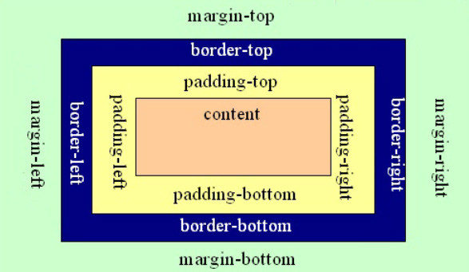

<div style="page-break-after: always;"></div>

## 8.3 文本样式

**文本样式**

`text-decoration`可以设置添加到文本的修饰，默认值为`none`。属性值为`underline`为文本添加下划线，属性值为`overline`为文本添加上划线，属性值为`line-through`为添加穿过文本的线，一般用于商品折扣价。

使用`line-height`可以设置段落中的行间距离（行高）。

`text-align`可以为文本设置对齐方式，属性值包括`left`、`right`和`center`。

---

【代码】文本样式

```html
<!DOCTYPE html>
<html lang="en">
<head>
    <meta charset="UTF-8">
    <title>文本样式</title>
    <style type="text/css">
        h2, p {
            text-decoration: underline;
            line-height: 2em;   /* 两倍行间距 */
            text-align: center;
        }
    </style>
</head>
<body>
    <h2>《望庐山瀑布》</h2>
    <p>唐·李白</p>
    <p>
        日照香炉生紫烟，<br/>
        遥看瀑布挂前川。<br/>
        飞流直下三千尺，<br/>
        疑是银河落九天。
    </p>
</body>
</html>
```

---

<div style="page-break-after: always;"></div>

# 第9章 盒子模型与布局模型

## 9.1 元素分类

**我要独占一行——块级元素**

在HTML中`<div>`、`<p>`、`<h1>`、`<form>`、`<ul>`、`<li>`等都是块级元素。每个块级元素都从新的一行开始，并且其后的元素也另起一行。块级元素的高度、宽度、行高遗迹顶和底边距都可以设置，宽度在不设定的情况下，是它本身父容器的`100%`（和父元素的宽度一致）。

---

【代码】块级元素

```html
<!DOCTYPE html>
<html lang="en">
<head>
    <meta charset="UTF-8">
    <title>块级元素</title>
</head>
<body>
    <div>这是一个div标签</div>
    <p>这是一个p标签</p>
    <h1>这是一个h1标签</h1>
</body>
</html>
```

---

通过设置`display: block`可以将元素显示为块级元素。


**我要和你站一起——内联元素**

在HTML中，`<span>`、`<a>`、`<label>`、`<strong>`、`<em>`等都是内联元素（行内元素）。内联元素和其它元素都在一行上，元素的高度、宽度及顶部和底部编剧不可设置，元素的宽度就是它包含的文字或图片的宽度，不可改变。

块级元素也可以设置`display: inline`将元素设置为内联元素。

---

【代码】内联元素与块级元素转换

```html
<!DOCTYPE html>
<html lang="en">
<head>
    <meta charset="UTF-8">
    <title>内联元素与块级元素转换</title>
    <style type="text/css">
        a {
            display: block;
        }

        div {
            display: inline;
        }
    </style>
</head>
<body>
    <a>我要变成块级元素</a>
    <a>我也要变成块级元素</a>

    <div>我要变成内联元素</div>
    <div>我也要变成内联元素</div>
</body>
</html>
```

---


**我还要占个大位置——内联块状元素**

内联块状元素就是同时具备内联元素和块级元素的特点。通过设置`display: inline-block`就可以将元素设置为内联块状元素。如``、`<input>`标签就是这种内联块状标签。

内联块状元素的特点是和其它元素都在一行上，但元素的高度、宽度、行高遗迹顶和底边距都可以设置。

<div style="page-break-after: always;"></div>

## 9.2 盒子模型

**盒子模型**

盒子模型包含4个部分：

- 外边距（margin）
- 外边框（border）
- 内边距（padding）
- 内容（content）


盒模型的宽度和高度和平常所说的物体的宽度和高度的理解是不一样的，CSS内定义的宽和高，指的是盒模型中内容的宽和高。

元素实际的宽度（盒子的宽度） = 左外边距 + 左边框 + 左内边距 + 内容宽度 + 右内边距 + 右边框 + 右外边距

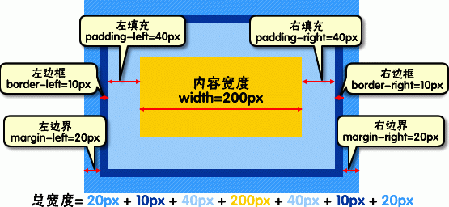


**外边框（Border）**

盒子模型的外边框可以设置粗细、样式和颜色：

1. `border-width`：设置边框的宽度，常用单位为像素（px）。
2. `border-style`：边框样式包括实线`solid`、虚线`dashed`、`dotted`点线。
3. `border-color`：设置边框颜色。

当三个属性都需要被设置时，也可以使用`border`属性简写。

例如设置一个粗细为`1px`实心的黑色边框：

```css
border: 1px solid black;
```

CSS中也允许只为一个方向的边框设置属性，使用`border-top`、`border-bottom`、`border-left`、`border-right`可以单独设置上、下、左、右四条边框。

元素边框的圆角效果可以使用`border-radius`属性来设置。设置圆角的值的顺序为左上、右上、右下、左下。如果`border-radius`属性只给出一个值表示四个圆角都被设置成该值。如果只给出两个值表示左上角和右下角设置为第一个值，右上角和左下角设置为第二个值。当给一个正方形的圆角效果值设置为其宽度一半时，显示效果为圆形。

---

【代码】圆形

```html
<!DOCTYPE html>
<html lang="en">
<head>
    <meta charset="UTF-8">
    <title>圆形</title>
    <style type="text/css">
        div {
            width: 100px;
            height: 100px;
            background-color: red;
            border-radius: 50%;
        }
    </style>
</head>
<body>
    <div></div>
</body>
</html>
```

---

通过单独设置每条边的属性，可以在正方形内展现不同的颜色。

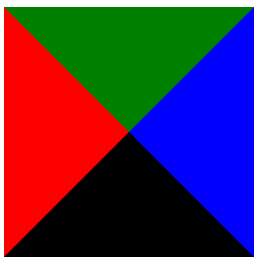

---

【代码】四色正方形

```html
<!DOCTYPE html>
<html lang="en">
<head>
    <meta charset="UTF-8">
    <title>四色正方形</title>
    <style type="text/css">
        div {
            width: 0;
            height: 0;
            border: 100px solid black;
            border-left-color: red;
            border-top-color: green;
            border-right-color: blue;
        }
    </style>
</head>
<body>
    <div></div>
</body>
</html>
```

---

通过设置透明色（transparent），可以绘制出三角形。

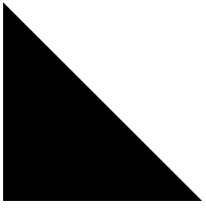

---

【代码】三角形

```html
<!DOCTYPE html>
<html lang="en">
<head>
    <meta charset="UTF-8">
    <title>三角形</title>
    <style type="text/css">
        div {
            width: 0;
            height: 0;
            border: 100px solid black;
            border-left-color: black;
            border-top-color: transparent;
            border-right-color: transparent;
        }
    </style>
</head>
<body>
    <div></div>
</body>
</html>
```

---


**内边距（Padding）**

元素内容与边框之间是可以设置距离的，称之为内边距或填充。内边距也可分为上、右、下、左（顺时针）。

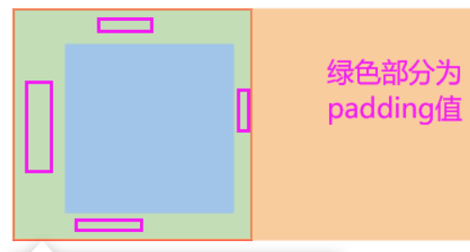


**外边距（Margin）**

元素与其他元素之间的距离可以使用外边距来设置，外边距也可分为上、右、下、左。


`margin`与`padding`的区别在于，`padding`在外边框里，`margin`在外边框外。

<div style="page-break-after: always;"></div>

## 9.3 布局模型

**布局模型**

布局模型建立在盒子模型的基础上，在网页中，元素有3种布局模型：

1. 流动模型（flow）
2. 浮动模型（float）
3. 层模型（layer）


**流动模型**

流动模型是默认的网页布局模式，也就是说网页在默认状态下的HTML网页元素都是根据流动模型来分布网页内容的。

流动布局模型有2个典型的特征：

1. 块级元素都会在所处的包含元素内自上而下按顺序垂直延伸分布，因为在默认状态下，块级元素的宽度都为`100%`，即都会以行的形式占据位置。

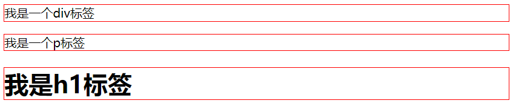

2. 内联元素都会在所处的包含元素内从左到右水平分布显示。

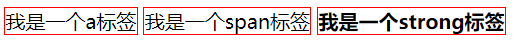


**浮动模型**

块级元素这么霸道都是独占一行，如果想让两个块级元素并排显示，可以设置元素浮动。任何元素在默认情况下是不能浮动的，但可以设置`float`属性定义为浮动，如`<div>`、`<p>`、`<table>`、``等元素都可以被定义为浮动。

---

【代码】浮动模型

```html
<!DOCTYPE html>
<html lang="en">
<head>
    <meta charset="UTF-8">
    <title>浮动模型</title>
    <style type="text/css">
        div {
            width: 100px;
            height: 100px;
            border: 1px solid red;
        }

        #div1 {
            float: left;
        }

        #div2 {
            float: right;
        }
    </style>
</head>
<body>
    <div id="div1"></div>
    <div id="div2"></div>
</body>
</html>
```

---

<div style="page-break-after: always;"></div>

## 9.4 定位

**层模型**

层布局模型就像是图像软件PhotoShop中非常流行的图层编辑功能一样，每个图形能够精确定位操作（positioning）。由于有些元素是定点展示的，定位技术可以让元素在特定的位置出现。

层模型有3种形式：

1. 绝对定位（absolute）
2. 相对定位（relative）
3.  固定定位（fixed）


**万事无绝对——绝对定位**

如果想为元素设置层模型中的绝对定位，需要设置`position: absolute`，这条语句的作用是将元素从文档流中拖出来，然后使用`left`、`right`、`top`、`bottom`属性相对于其最接近的一个具有定位属性的父包含块进行绝对定位。如果不存在这样的包含块，则相对于`body`元素，即相对于浏览器窗口。

当一个元素成为绝对定位元素，它就脱离了原来的层面，原来的位置会空出，下面的元素都会上来。

---

【代码】绝对定位

```html
<!DOCTYPE html>
<html lang="en">
<head>
    <meta charset="UTF-8">
    <title>绝对定位</title>
    <style type="text/css">
        div {
            width: 100px;
            height: 100px;
        }

        #div1 {
            background-color: red;
            position: absolute;
            top: 50px;      /* 距离窗口上边50px */
            left: 100px;    /* 距离窗口左边100px */
        }

        #div2 {
            background-color: blue;
        }
    </style>
</head>
<body>
    <div id="div1"></div>
    <div id="div2"></div>
</body>
</html>
```

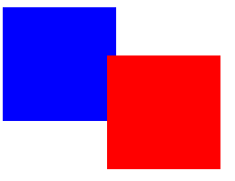

---


**相对于自己的位置——相对定位**

如果想为元素设置层模型中的相对定位，需要设置`position: relative`，它通过`left`、`right`、`top`、`bottom`属性确定元素在正常文档流中的偏移位置。相对定位完成的过程是首先按`static (float)`方式生成一个元素，然后相对于以前的位置移动，并且偏移前的位置保留不动，因此下面的元素无法上来。

---

【代码】相对定位

```html
<!DOCTYPE html>
<html lang="en">
<head>
    <meta charset="UTF-8">
    <title>相对定位</title>
    <style type="text/css">
        div {
            width: 100px;
            height: 100px;
        }

        #div1 {
            background-color: red;
            position: relative;
            top: 50px;
            left: 100px;
        }

        #div2 {
            background-color: blue;
        }
    </style>
</head>
<body>
    <div id="div1"></div>
    <div id="div2"></div>
</body>
</html>
```

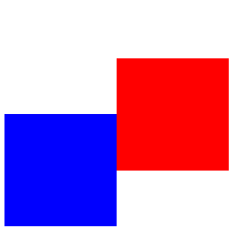

---

使用`position: absolute`可以实现元素相对于浏览器（`body`）设置定位，那可不可以相对于其它元素进行定位呢？当然可以，但是必须要满足以下的3点条件：

1. 参照定位的元素必须是相对定位元素的前辈元素。
2. 参照定位的元素必须加入`position: relative`。
3. 定位元素加入`position: absolute`后便可以使用`top`、`bottom`、`left`、`right`来进行偏移了。

---

【代码】相对父元素定位

```html
<!DOCTYPE html>
<html lang="en">
<head>
    <meta charset="UTF-8">
    <title>相对父元素定位</title>
    <style type="text/css">
        #div1 {
            width: 100px;
            height: 100px;
            background-color: red;
            position: relative;
        }

        #div2 {
            width: 100px;
            height: 20px;
            background-color: blue;
            position: absolute;
            top: 40px;
        }
    </style>
</head>
<body>
    <div id="div1">
        <div id="div2"></div>
    </div>
</body>
</html>
```

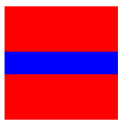

---


**我就在那不动了——固定定位**

通过设置`position: fixed`让一个元素固定在一个位置，它的相对移动的坐标是视图（屏幕内的网页窗口）本身。由于视图本身是固定的，它不会随着浏览器窗口的滚动条滚动而变化，除非在屏幕中移动浏览器窗口的屏幕位置，或改变浏览器窗口的显示大小。因此固定定位的元素会始终位于浏览器窗口内视图的某个位置，不会受文档流影响。

---

【代码】固定定位

```html
<!DOCTYPE html>
<html lang="en">
<head>
    <meta charset="UTF-8">
    <title>固定定位</title>
    <style type="text/css">
        img {
            position: fixed;
            top: 15%;
            left: 20%;
        }
    </style>
</head>
<body>
    
    <br><br><br><br><br><br><br><br><br><br><br><br><br><br><br><br><br><br><br><br><br><br><br><br><br><br><br><br><br><br><br><br><br><br><br><br><br><br><br><br><br><br><br><br><br><br><br><br><br><br>
</body>
</html>
```

---

【代码】奥运五环

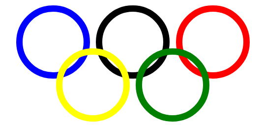

- index.html

```html
<!DOCTYPE html>
<html lang="en">
<head>
    <meta charset="UTF-8">
    <title>奥运五环</title>
    <link rel="stylesheet" type="text/css" href="olympic.css">
</head>
<body>
    <!-- 展示奥运五环的区域 -->
    <div class="stage">
        <div id="circle1"></div>
        <div id="circle2"></div>
        <div id="circle3"></div>
        <div id="circle4"></div>
        <div id="circle5"></div>
    </div>
</body>
</html>
```

- style.css

```css
* {
    margin: 0;
    padding: 0;
}

.stage {
    position: absolute;
    left: 50%;
    top: 50%;
    margin-left: -190px;
    margin-top: -93px;
    height: 185px;
    width: 380px;
}

#circle1,
#circle2,
#circle3,
#circle4,
#circle5 {
    position: absolute;
    width: 100px;
    height: 100px;
    border: 10px solid black;
    border-radius: 50%;
}

#circle1 {
    border-color: blue;
    left: 0;
    top: 0;
}

#circle2 {
    border-color: black;
    left: 130px;
    top: 0;
}

#circle3 {
    border-color: red;
    left: 260px;
    top: 0;
}

#circle4 {
    border-color: yellow;
    left: 65px;
    top: 70px;
}

#circle5 {
    border-color: green;
    left: 195px;
    top: 70px;
}
```

---

<div style="page-break-after: always;"></div>

# 第10章 JavaScript介绍

## 10.1 编程简介

**编程简介**

程序（program）是为了让计算机执行某些操作或者解决问题而编写的一系列有序指令的集合。由于计算机只能够识别二进制数字0和1，因此需要使用特殊的编程语言来描述如何解决问题过程和方法。

算法（algorithm）是可完成特定任务的一系列步骤，算法的计算过程定义明确，通过一些值作为输入并产生一些值作为输出。

流程图（flow chart）是算法的一种图形化表示方式，使用一组预定义的符号来说明如何执行特定任务。

- 圆角矩形：开始和结束
- 矩形：数据处理
- 平行四边形：输入/输出
- 菱形：分支判断条件
- 流程线：步骤

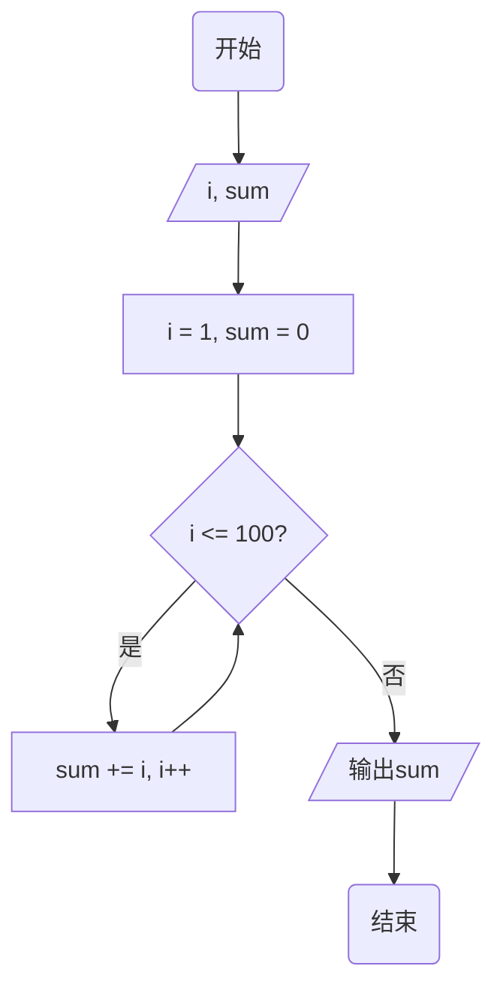


**编程语言（Programming Language）**

编程语言主要分为面向机器、面向过程和面向对象三类。C语言是面向过程的语言，常用于操作系统、嵌入式系统、驱动程序、图形引擎、图像处理、声音效果等。

JavaScript是一种具有函数优先的轻量级，解释型或即时编译型的编程语言。虽然它是作为开发Wwb页面的脚本语言而出名，但是它也被用到了很多非浏览器环境中。JavaScript基于原型编程、多范式的动态脚本语言，并且支持面向对象、命令式、声明式、函数式编程范式。


<div style="page-break-after: always;"></div>

## 10.2 Hello World!

**Hello World!**

使用`<script>`标签在HTML网页中插入JavaScript代码。

```html
<script type="text/JavaScript">
    // JavaScript代码
</script>
```

`type`属性表示在`<script>`标签之间的是文本类型，告诉了浏览器里面的文本属于JavaScript语言。

JS作为一种脚本语言可以放在HTML页面中任何位置，但是一般放在网页的`<head>`或`<body>`部分。最常用的方式是在页面`<head>`部分放置`<script>`元素，浏览器解析HTML时是按先后顺序的，所以前面的`<script>`就先被执行。


**引入外部JS文件**

除了在HTML文件中使用`<script>`标签添加JS代码，还能把HTML和JS分开，单独创建一个JS文件，其文件后缀为`.js`，然后直接将JS代码写在JS文件中。注意在JS文件中，不需要`<script>`标签，直接编写JS代码即可。

JS文件不能直接运行，需要嵌入到HTML文件中执行，因此需要在HTML中引入外部JS文件，

```html
<script src="JS文件.js"></script>
```

---

【代码】Hello World!

- hello_world.html

```html
<!DOCTYPE html>
<html lang="en">
<head>
    <meta charset="UTF-8">
    <title>Hello World!</title>
    <script src="hello_world.js"></script>
</head>
<body>
    
</body>
</html>
```

- hello_world.js

```js
document.write("Hello World!");
```

---

<div style="page-break-after: always;"></div>

## 10.3 语句与注释

**语句**

JS语句是发给浏览器的命令，这些命令的作用是告诉浏览器要做的事情。一行语句通常在结尾加上一个`;`表示语句的结束，虽然分号也可以不写，但是要养成编程的好习惯，记得在语句末尾加上分号。


**注释（Comment）**

在编程中加入注释可以增加程序的可读性和可维护性，编译器不会对注释的部分进行编译。

JS中注释分为两类：

1. 单行注释：将一行内`//`之后的内容视为注释。
2. 多行注释：以`\*`开始，`*/`结束，中间的内容视为注释。

---

【代码】注释

```js
document.write("单行注释");     // 我是单行注释
/*
    我是
    多行
    注释
*/
document.write("多行注释");
```

---

<div style="page-break-after: always;"></div>

## 10.4 互动方法

**document.write()**

`document.write()`可用于直接向HTML输出流写内容，简单地说就是直接在网页中输出内容。

---

【代码】document.write()

```js
document.write("互动方法：document.write()");
```

---


**console.log()**

`console.log()`方法用于在控制台输出信息，该方法对于开发过程进行测试很有帮助。

---

【代码】console.log()

```js
console.log("互动方法：console.log()");
```

---


**alert()**

在访问网站的时候，有时会突然弹出一个小窗口，上面写着一段提示信息文字，如果不点击“确定”，就不能对网页做任何操作，这个小窗口就是使用`alert()`实现的。

---

【代码】alert()

```js
alert("互动方法：alert()");
```

---


**confirm()**

`confirm()`消息对话框通常用于允许用户做选择的动作，弹出对话框包含一个确定按钮和一个取消按钮。

`confirm()`的返回值为`boolean`值，当用户点击`确定`按钮时返回`true`，当用户点击`取消`按钮时返回`false`。

---

【代码】confirm()

```js
confirm("互动方法：confirm()");
```

---


**prompt()**

`prompt()`弹出消息对话框，通常用于询问一些需要与用户交互的信息，弹出的消息对话框包含一个确定按钮、取消按钮和一个文本输入框。

```js
prompt(str1, str2);
```

> - str1：要显示在消息对话框中的文本，不可修改。
> - str2：文本框中的内容，可以修改。

点击`确定`按钮，文本框中的内容将作为函数的返回值；点击`取消`按钮，将返回`null`。

---

【代码】prompt()

```js
prompt("互动方法：prompt()", "文本内容");
```

---

<div style="page-break-after: always;"></div>

## 10.5 变量

**变量（Variable）**

变量是计算机中一块特定的内存空间，由一个或多个连续的字节组成，不同数据存入具有不同内存地址的空间，相互独立，通过变量名可以简单快速地找到在内存中存储的数据。定义变量使用关键字`var`。

```js
var variable_name;
```

变量名需要符合以下的要求：

1. 由字母、数字和下划线组成，第一个字符必须为字母或下划线
2. 不能包含除`_`以外的任何特殊字符，如`%`、`#`等
3. 不可以使用保留字或关键字
4. 准确、顾名思义，不要使用汉语拼音

关键字是编程语言内置的一些名称，具有特殊的用处和意义。

|  关键字  |              |           |          |            |
| :------: | :----------: | :-------: | :------: | :--------: |
|  break   |     else     |    new    |   var    |    case    |
| finally  |    return    |   void    |  catch   |    for     |
|  switch  |    while     |  default  |    if    |   throw    |
|  delete  |      in      |    try    |    do    | instanceof |
|  typeof  |   abstract   |   enum    |   int    |   short    |
| boolean  |    export    | interface |  static  |    byte    |
| extends  |     long     |   super   |   char   |   final    |
|  native  | synchronized |   class   |  float   |  package   |
|  throws  |    const     |   goto    | private  | transient  |
| debugger |  implements  | protected | volatile |   double   |
|  import  |    public    |           |          |            |


**初始化（Initialization）**

变量可以在定义时初始化，也可以在定义后初始化。

在编程中，`=`不是数学中的`等于`符号，而是表示`赋值`，即将`=`右边的值赋给左边的变量。

```js
var n = 10;
var wage = 8232.56;
```

JS变量虽然也可以不声明直接使用，但是这样不规范。

<div style="page-break-after: always;"></div>

## 10.6 数据类型

**数据类型**

JS中变量主要有以下几种类型：

1. 数字`number`：整型、浮点型
2. 字符串`string`
3. 布尔`boolean`
4. 空对象`null`
5. 未定义`undefined`
6. 复杂数据类型：数组`Array`、对象`Object`

使用`typeof()`方法可以检测一个变量的数据类型。

---

【代码】数据类型

```js
var a = 12;
var b = 3.1415;
var c = "hello";
var d = false;

console.log(typeof(a))
console.log(typeof(b))
console.log(typeof(c))
console.log(typeof(d))
```

> 运行结果

```
number
number
string
boolean
```

---


**类型转换**

类型转换是把变量从一种类型转换为另一种数据类型。类型转换可以是隐式的，也可以是显式的，通过使用强制类型转换的方法来指定。

---

【代码】类型转换

```js
console.log(Number("123"));
console.log(parseInt("456"));
console.log(parseFloat("78.9"));
console.log(String(123456789));
console.log(Boolean(0));
console.log(Boolean(1));
```

> 运行结果

```
123
456
78.9
123456789
false
true
```

---

<div style="page-break-after: always;"></div>

## 10.7 算术运算符

**四则运算**

|  数学符号  |  JS符号  | 含义 |
| :--------: | :------: | :--: |
|   $ + $    |  $ + $   | 加法 |
|   $ - $    |  $ - $   | 减法 |
| $ \times $ | $ \ast $ | 乘法 |
|  $ \div $  |  $ / $   | 除法 |
|            |  $ \% $  | 取模 |

JS中除法`/`的意义与数学中不同：

1. 当相除的两个运算数都为整型，则运算结果为两个数进行除法运算后的整数部分，例如`21 / 5`的结果为`4`。
2. 如果两个运算数其中至少一个为浮点型，则运算结果为浮点型，如`21 / 5.0`的结果为`4.2`。

取模（modulo）`%`表示求两个数相除之后的余数，如`22 % 3`的结果为`1`、`4 % 7`的结果为`4`。


**复合赋值运算符**

| 运算符 | 描述                  |
| :----: | :-------------------- |
|   +=   | a += b等价于a = a + b |
|   -=   | a -= b等价于a = a - b |
|   *=   | a *= b等价于a = a * b |
|   /=   | a /= b等价于a = a / b |
|   %=   | a %= b等价于a = a % b |

<div style="page-break-after: always;"></div>

## 10.8 **表达式**

**字符串连接**

`+`运算符不只代表加法，还可以用于连接两个字符串。

---

【代码】字符串连接

```js
console.log("Hello" + "World");
```

> 运行结果

```
HelloWorld
```

---


**转义字符**

在一个字符串描述的过程中，有可能会有一些特殊字符的信息。

| 转义字符 | 描述                       |
| :------: | :------------------------- |
|    \     | 续行符，实现字符串多行定义 |
|   \\\    | 表示一个反斜杠`\`          |
|   \\'    | 表示一个单引号`'`          |
|   \\"    | 表示一个双引号`"`          |
|    \n    | 换行                       |
|    \t    | 横向制表符                 |
|    \v    | 纵向制表符                 |
|    \f    | 换页                       |
|    \b    | 退格                       |

---

【代码】转义字符

```js
console.log("全球最大同性交友网站\n\'https://github.com\'");
```

> 运行结果

```
全球最大同性交友网站
'https://github.com'
```

---


**表达式（Expression）**

表达式与数学中的定义相似，表达式是值具有一定的值，用操作符把常数和变量连接起来的代数式。

使用`prompt()`可以获取用户输入的信息，返回值为字符串类型。

---

【代码】计算圆的面积

```js
var PI = 3.14159;
var r = parseFloat(prompt("输入半径"));
var area = PI * r ** 2;
console.log("面积 = " + area);
```

> 运行结果

```
输入半径：5
面积 = 78.53975
```

---

`Math.floor()`的作用是向下取整，`Math.ceil()`的作用是向上取整。

---

【代码】逆序三位数

```js
var num = parseInt(prompt("输入一个正三位数"));
var a = Math.floor(num / 100);
var b = Math.floor(num / 10) % 10;
var c = num % 10;

num = c * 100 + b * 10 + a;
console.log("逆序：" + num);
```

> 运行结果

```
输入一个正三位数：520
逆序：25
```

---

<div style="page-break-after: always;"></div>

# 第11章 判断

## 11.1 逻辑运算符

**关系运算符**

| 数学符号 | 关系运算符 |
| :------: | :--------: |
|  $ < $   |   $ < $    |
|  $ > $   |   $ > $    |
| $ \leq $ |   $ <= $   |
| $ \geq $ |   $ >= $   |
| $ \neq $ |   $ != $   |
|  $ = $   |   $ == $   |


**逻辑运算符**

JS中逻辑运算符有三种：

1. 逻辑与`&&`（logical AND）：当多个条件同时为真，结果为真。

| 条件1 | 条件2 | 条件1 && 条件2 |
| :---: | :---: | :------------: |
|   T   |   T   |       T        |
|   T   |   F   |       F        |
|   F   |   T   |       F        |
|   F   |   F   |       F        |

2. 逻辑或`||`（logical OR）：多个条件有一个为真时，结果为真。

| 条件1 | 条件2 | 条件1 \|\| 条件2 |
| :---: | :---: | :--------------: |
|   T   |   T   |        T         |
|   T   |   F   |        T         |
|   F   |   T   |        T         |
|   F   |   F   |        F         |

3. 逻辑非`!`（logical NOT）：条件为真时，结果为假；条件为假时，结果为真。

| 条件 | !条件 |
| :--: | :---: |
|  T   |   F   |
|  F   |   T   |

<div style="page-break-after: always;"></div>

## 11.2 if

**if**

当`if`语句的条件为真时，进入花括号执行内部的代码；若条件为假，则跳过花括号执行后面的代码。

`if`语句主要有以下几种形式：

- 单分支

```js
if(条件) {
    // code
}
```

- 双分支

```js
if(条件) {
    // code
} else {
    // code
}
```

- 多分支

```js
if(条件1) {
    // code
} else if(条件2) {
    // code
} else {
    // code
}
```


---

【代码】if

```js
var age = 15;
if(age > 0 && age < 18) {
    console.log("未成年")
}
```

> 运行结果

```
未成年
```

---

【代码】if-else

```js
var age = 30;
if(age > 0 && age < 18) {
    console.log("未成年人")
} else {
    console.log("成年人");
}
```

> 运行结果

```
成年人
```

---

【代码】if-else_if-else

```js
var score = 76;

if(score >= 90 && score <= 100) {
    console.log("优秀");
} else if(score >= 60 && score < 90) {
    console.log("合格");
} else {
    console.log("不合格");
}
```

> 运行结果

```
合格
```

---


**嵌套结构**

`if`语句也可以嵌套使用：

```js
if(条件1) {
    if(条件2) {
        // code
    }
}
```

---

【代码】判断整数奇偶

```js
var num = parseInt(prompt("输入一个正整数"));

if(num > 0) {
    if(num % 2 == 0) {
        console.log(num + "是偶数");
    } else {
        console.log(num + "是奇数");
    }
}
```

> 运行结果

```
输入一个正整数：66
66是偶数
```

---

<div style="page-break-after: always;"></div>

## 11.3 switch

**switch**

`switch-case`结构可以对整数值的表达式进行判断。

```js
switch(表达式) {
    case label:
        //code
        break;
    // ...
    default:
        //code
        break;
}
```

根据表达式的值，跳转到对应的`case`处进行执行。需要注意的是，当对应的`case`中的代码被执行完后，并不会跳出`switch`，而是会继续执行后面的代码，所以需要使用`break`跳出`switch`结构。

当所有`case`都不满足表达式的值时，会执行`default`语句中的代码，相当于`if-else`结构中的`else`。

---

【代码】根据月份输出对应的英语简写

```js
var month = parseInt(prompt("输入月份"));

switch(month) {
    case 1:
        console.log("Jan.");
        break;
    case 2:
        console.log("Feb.");
        break;
    case 3:
        console.log("Mar.");
        break;
    case 4:
        console.log("Apr.");
        break;
    case 5:
        console.log("May");
        break;
    case 6:
        console.log("Jun.");
        break;
    case 7:
        console.log("Jul.");
        break;
    case 8:
        console.log("Aug.");
        break;
    case 9:
        console.log("Sep.");
        break;
    case 10:
        console.log("Oct.");
        break;
    case 11:
        console.log("Nov.");
        break;
    case 12:
        console.log("Dec.");
        break;
    default:
        alert("输入有误");
        break;
}
```

> 运行结果

```
输入月份：5
May
```

---

<div style="page-break-after: always;"></div>

# 第12章 循环

## 12.1 自增/自减运算符

**自增/自减运算符**

单目运算符中自增`++`和自减`--`运算符可以将变量的值加1和减1，但是`++`和`--`可以出现在变量之前或之后，即有四种情况：

1. 前缀自增
2. 前缀自减
3. 后缀自增
4. 后缀自减

| 表达式  | 含义                 |
| :-----: | -------------------- |
| count++ | 执行完所在语句后自增 |
| ++count | 执行所在语句前自增   |
| count-- | 执行完所在语句后自减 |
| --count | 执行所在语句前自减   |

<div style="page-break-after: always;"></div>

## 12.2 while

**while**

在`while`循环中，当条件满足时重复循环体内的语句。如果条件永远为真，循环会永无止境的进行下去（死循环），因此循环体内要有改变条件的机会。

控制循环次数的方法就是设置循环变量：初值、判断、更新。

`while`循环的特点是先判断、再执行，所以循环体有可能会进入一次或多次，也有可能一次也不会进入。

```js
while(条件) {
    // code
}
```

---

【代码】计算5个人的平均身高

```js
var height;
var total = 0;
var average;
var i = 1;

while(i <= 5) {
    height = parseFloat(prompt("输入第" + i + "个人的身高"));
    total += height;
    i++;
}

average = total / 5;
console.log("平均身高：" + average);
```

> 运行结果

```
输入第1个人的身高：160.8
输入第2个人的身高：175.2
输入第3个人的身高：171.2
输入第4个人的身高：181.3
输入第5个人的身高：164
平均身高：170.5
```

---

<div style="page-break-after: always;"></div>

## 12.3 do-while

**do-while**

`do-while`循环在进入循环的时候不做检查，而是在执行完一轮循环体的代码之后，再来检查循环的条件是否满足，如果满足则继续下一轮循环，不满足则结束循环，即至少执行一次循环。

`do-while`循环的主要特点是先执行、再判断。

```js
do {
    // code
} while(条件);
```

---

【代码】计算整数位数

```js
var num = 123;
var n = 0;

do {
    num = Math.floor(num / 10);
    n++;
} while(num != 0);

console.log("位数：" + n);
```

> 运行结果

```
输入整数：123
位数：3
```

---


**while与do-while区别**

`while`循环与`do-while`循环有以下区别：

1. 执行顺序不同。
2. 初始情况不满足循环条件时，`while`循环一次都不会执行，`do-while`循环不管任何情况都至少执行一次。
3. `do-while`循环的`while`语句后有`;`。


---

【代码】猜数字

```js
//产生1-100之间的随机数
var answer = Math.floor(Math.random() * 100) + 1;
var num = 0;
var cnt = 0;

do {
    num = parseInt(prompt("猜一个1-100之间的数字"));
    cnt++;
    if(num > answer) {
        alert("猜大了！");
    } else if(num < answer) {
        alert("猜小了！");
    }
} while(num != answer);

alert("猜对了！你一共用了" + cnt + "次猜对！");
```

> 运行结果

```
猜一个1-100之间的数字：50
猜大了！
猜一个1-100之间的数字：25
猜小了！
猜一个1-100之间的数字：37
猜小了！
猜一个1-100之间的数字：43
猜小了！
猜一个1-100之间的数字：46
猜小了！
猜一个1-100之间的数字：48
猜小了！
猜一个1-100之间的数字：49
猜对了！你一共用了7次猜对！
```

---

<div style="page-break-after: always;"></div>

## 12.4 for

**for**

`for`循环有三个表达式，中间用`;`分隔，`;`不可省略。

```js
for(表达式1; 表达式2; 表达式3) {
    //code
}
```

- 表达式1通常是为循环变量赋初值，可省略
- 表达式2是循环条件，判断是否继续执行循环，可省略
- 表达式3为更新循环变量的值，可省略

---

【代码】计算1-100的累加和

```js
var sum = 0;
for(var i = 1; i <= 100; i++) {
    sum += i;
}
console.log("累加：" + sum);
```

> 运行结果

```
累加：5050
```

---

【代码】计算$ 1 + {1 \over 2} + {1 \over 3} + ... + {1 \over n} $

```js
var n = 10;
var sum = 0;

for(var i = 1; i <= n; i++) {
    sum += 1 / i;
}

console.log(sum);
```

> 运行结果

```
2.928968
```

---

【代码】斐波那契数列（兔子数列）


```js
var n = 10;
var num1, num2, val;
var str = "";

if(n == 1) {
    console.log("1");
} else if(n == 2) {
    console.log("1, 1");
} else {
    num1 = 1;
    num2 = 1;
    str = "1, 1";
    for(var i = 3; i <= n; i++) {
        val = num1 + num2;
        str += ", " + val;
        num1 = num2;
        num2 = val;
    }
    console.log(str);
}
```

> 运行结果

```
1, 1, 2, 3, 5, 8, 13, 21, 34, 55
```

---


**嵌套循环**

循环也可以进行嵌套使用。

---

【代码】九九乘法表


```js
var str = "";

for(var i = 1; i <= 9; i++) {
    for(var j = 1; j <= 9; j++) {
        str += i + "*" + j + "=" + i*j + "\t";
    }
    str += "\n";
}
console.log(str);
```

---

【代码】输出图案

```
*
**
***
****
*****
```

```js
var str = "";

for(var i = 1; i <= 5; i++) {
    for(var j = 1; j <= i; j++) {
        str += "*";
    }
    str += "\n";
}
console.log(str);
```

---

<div style="page-break-after: always;"></div>

## 12.5 break or continue?

**循环控制**

循环控制语句的作用是控制当前的循环结构是否继续向下执行，如果不进行控制，那么会根据既定的结构重复执行。如果有一些特殊的情况导致循环的执行中断，就称为循环的控制语句。循环控制语句的关键字有`break`和`continue`。

`break`的作用是跳出当前循环，执行当前循环之后的语句。`break`只能跳出一层循环，如果是嵌套循环，那么需要按照嵌套的层次，逐步使用`break`来跳出。`break`语句只能在循环体内和`switch`语句内使用。

`continue`的作用是跳过本轮循环，开始下一轮循环的条件判断。`continue`终止当前轮的循环过程，但它并不跳出循环。

---

【代码】break

```js
var str = "";

for(var i = 1; i <= 10; i++) {
    if(i == 5) {
        break;
    }
    str += i + " ";
}

console.log(str);
```

> 运行结果

```
1 2 3 4 
```

---

【代码】continue

```js
var str = "";

for(var i = 1; i <= 10; i++) {
    if(i == 5) {
        continue;
    }
    str += i + " ";
}

console.log(str);
```

> 运行结果

```
1 2 3 4 6 7 8 9 10
```

---

<div style="page-break-after: always;"></div>

# 第13章 数组

## 13.1 一维数组

**数组（Array）**

一个变量只能存储一个内容，如果需要存储更多数据，就需要使用数组解决问题。一个数组变量可以存放多个数据，数组是一个值的集合，它们共享同一个名字，数组中的每个变量都能被其下标所访问。


- 元素：数组中的每个变量

- 大小：数组的容量

- 下标 / 索引（index）：元素的位置，下标从0开始，必须为非负整数

使用数组之前首先要创建数组，数组的创建有2种方式：

1. 直接创建

```js
var arr1 = [];          //创建一个空数组
var arr2 = [1, 2, 3];   //创建有内容的数组
```

2. 利用构造函数创建

```js
var arr1 = new Array();                 //创建空数组
var arr2 = new Array(10);               //创建一个长度为10的数组
var arr3 = new Array(5, 4, 3, 2, 1);    //创建数组并初始化
```

虽然创建数组时指定了长度，但实际上数组都是变长的，也就是说即使指定了长度，仍然可以将元素存储在规定长度以外。


**数组初始化**

很多时候在使用数组之前需要将数组的内容全部清空，这可以利用循环来实现。

```js
var arr = new Array(100);
for(var i = 0; i < arr.length; i++) {
    arr[i] = 0;
}
```

---

【代码】数组最大值和最小值

```js
var num = [7, 6, 2, 9, 3, 1, 4, 0, 5, 8];
var max = num[0];
var min = num[0];

for(var i = 1; i < num.length; i++) {
    if(num[i] > max) {
        max = num[i];
    } else if(num[i] < min) {
        min = num[i];
    }
}

console.log("max = " + max);
console.log("min = " + min);
```

> 运行结果

```
max = 9
min = 0
```

---

<div style="page-break-after: always;"></div>

## 13.2 二维数组

**二维数组（2D Array）**

二维数组包括行和列两个维度，可以看成是由多个一维数组组成。

|  二维数组   |             |             |             |
| :---------: | :---------: | :---------: | :---------: |
| a\[0\]\[0\] | a\[0\]\[1\] | a\[0\]\[2\] | a\[0\]\[3\] |
| a\[1\]\[0\] | a\[1\]\[1\] | a\[1\]\[2\] | a\[1\]\[3\] |
| a\[2\]\[0\] | a\[2\]\[1\] | a\[2\]\[2\] | a\[2\]\[3\] |

---

【代码】直接创建二维数组

```js
var arr = [[1, 2], [3, 4]];
console.log(arr);
```

> 运行结果

```
(2) [Array(2), Array(2)]
	0: (2) [1, 2]
	1: (2) [3, 4]
		length: 2
```

---

【代码】构造函数创建二维数组

```js
var arr = new Array(3);
for(var i = 0; i < arr.length; i++) {
    arr[i] = new Array(4);
}
```

> 运行结果

```
(3) [Array(4), Array(4), Array(4)]
	0: (4) [empty× 4]
	1: (2) [empty× 4]
	2: (4) [empty× 4]
		length: 3
```

---

利用两层循环来初始化二维数组。

---

【代码】初始化二维数组

```js
var arr = new Array(3);
for(var i = 0; i < arr.length; i++) {
    arr[i] = new Array(4);
    for(var j = 0; j < arr[i].length; j++) {
        arr[i][j] = 0;
    }
}
```

---

【代码】矩阵运算

> 矩阵的加法/减法是指两个矩阵把其相对应元素进行加减的运算。
>
> 矩阵加法：两个$ m \times n $矩阵A和B的和，标记为$ A + B $，结果为一个$ m \times n $的矩阵，其内的各元素为其相对应元素相加后的值。
>
> 矩阵减法：两个$ m \times n $矩阵A和B的差，标记为$ A - B $，结果为一个$ m \times n $的矩阵，其内的各元素为其相对应元素相减后的值。
>
> $$
> \left[\begin{matrix} 
> 	1 & 3 \\
> 	1 & 0 \\
> 	1 & 2 \\
> \end{matrix} \right]
> +
> \left[\begin{matrix} 
> 	0 & 0 \\
> 	7 & 5 \\
> 	2 & 1 \\
> \end{matrix} \right]
> =
> \left[\begin{matrix} 
> 	1+0 & 3+0 \\
> 	1+7 & 0+5 \\
> 	1+2 & 2+1 \\
> \end{matrix} \right]
> =
> \left[\begin{matrix} 
> 	1 & 3 \\
> 	8 & 5 \\
> 	3 & 3 \\
> \end{matrix} \right]
> $$
>
> $$
> \left[\begin{matrix} 
> 	1 & 3 \\
> 	1 & 0 \\
> 	1 & 2 \\
> \end{matrix} \right]
> -
> \left[\begin{matrix} 
> 	0 & 0 \\
> 	7 & 5 \\
> 	2 & 1 \\
> \end{matrix} \right]
> =
> \left[\begin{matrix} 
> 	1-0 & 3-0 \\
> 	1-7 & 0-5 \\
> 	1-2 & 2-1 \\
> \end{matrix} \right]
> =
> \left[\begin{matrix} 
> 	1 & 3 \\
> 	-6 & -5 \\
> 	-1 & 1 \\
> \end{matrix} \right]
> $$

```js
var A = [
    [1, 3],
    [1, 0],
    [1, 2]
];

var B = [
    [0, 0],
    [7, 5],
    [2, 1]
];

var C = new Array(3);
for (var i = 0; i < C.length; i++) {
    C[i] = new Array(2);
}

console.log("矩阵加法");
for(var i = 0; i < C.length; i++) {
    for (var j = 0; j < C[i].length; j++) {
        C[i][j] = A[i][j] + B[i][j];
    }
}
console.log(C);

console.log("矩阵减法");
for(var i = 0; i < C.length; i++) {
    for(var j = 0; j < C[i].length; j++) {
        C[i][j] = A[i][j] - B[i][j];
    }
}
console.log(C);
```

> 运行结果

```
矩阵加法
[ [ 1, 3 ], [ 8, 5 ], [ 3, 3 ] ]
矩阵减法
[ [ 1, 3 ], [ -6, -5 ], [ -1, 1 ] ]
```

---

<div style="page-break-after: always;"></div>

## 13.3 数组操作

**数组操作**

数组的常见操作主要包括：

1. 计算数组长度：引用数组的`length`属性获取数组长度，需要注意的是，JS数组的`length`属性是可变的。

---

【代码】计算数组长度

```js
var arr = [0, 1, 2, 3, 4];
console.log(arr.length);
arr.length = 10;
console.log(arr.length);
```

> 运行结果

```
5
10
```

---

2. 增加元素：
    - 使用下一个未使用的索引，任何时刻可以不断向数组增加新元素。
    - 使用`unshift()`方法可以向数组第一个元素前面添加一个元素，返回值为数组长度。
    - `push()`方法可以向数组最后一个元素后面添加一个元素，返回值为数组长度。

---

【代码】增加元素

```js
var arr = [0, 1, 2, 3, 4];
arr[5] = 5;
console.log(arr);
```

> 运行结果

```
[0, 1, 2, 3, 4, 5]
```

---

【代码】unshift()

```js
var arr = [0, 1, 2, 3, 4];
arr.unshift(5);
console.log(arr);
```

> 运行结果

```
[5, 0, 1, 2, 3, 4]
```

---

【代码】push()

```js
var arr = [0, 1, 2, 3, 4];
arr.push(5);
console.log(arr);
```

> 运行结果

```
[0, 1, 2, 3, 4, 5]
```

---

3. 删除元素：
    - `shift()`方法可以删除数组的第一个元素，返回值为被删除元素。
    - `pop()`方法可以删除数组的最后一个元素，返回值为被删除元素。

---

【代码】shift()

```js
var arr = [0, 1, 2, 3, 4];
arr.shift();
console.log(arr);
```

> 运行结果

```
[1, 2, 3, 4]
```

---

【代码】pop()

```js
var arr = [0, 1, 2, 3, 4];
arr.pop();
console.log(arr);
```

> 运行结果

```
[0, 1, 2, 3]
```

---

4. 合并数组：使用`concat()`方法可以合并两个或多个数组，该方法不会改变原有数组，而是返回一个新的合并完的数组。

---

【代码】concat()

```js
var arr1 = [1, 2, 3, 4, 5];
var arr2 = [6, 7, 8, 9, 10];
console.log(arr1.concat(arr2));
console.log(arr1);
console.log(arr2);
```

> 运行结果

```
[1, 2, 3, 4, 5, 6, 7, 8, 9, 10]
[1, 2, 3, 4, 5]
[6, 7, 8, 9, 10]
```

---

5. 数组转字符串：使用`join(separator)`方法可以将数组转换为字符串，其中`separator`参数可选，用于指定要使用的分隔符，如果该参数省略，则使用逗号作为分隔符。

---

【代码】join()

```js
var arr = [0, 1, 2, 3, 4];
console.log(arr.join());
```

> 运行结果

```
0,1,2,3,4
```

---

6. 字符串转数组：使用`split(separator, n)`方法可以将字符串转换为数组，其中参数`separator`必选，用于指定将字符串按某个字符切割成若干个子字符串，并以数组的形式返回。参数`n`可选，用于指定返回的数组的最大长度，如果设置了该参数，返回的子串数量不会多于`n`；如果没有设置该参数，整个字符串都会被分隔。

---

【代码】split()

```js
var str = "hello HTML hello CSS hello JavaScript";
var arr = str.split(' ');
console.log(arr);
```

> 运行结果

```
["hello", "HTML", "hello", "CSS", "hello", "JavaScript"]
```

---

7. 翻转数组：使用`reverse()`方法可以颠倒数组中元素的顺序。

---

【代码】reverse()

```js
var arr = [1, 2, 3, 4, 5];
console.log(arr.reverse());
```

> 运行结果

```
[5, 4, 3, 2, 1]
```

---

8. 数组排序：使用`sort(sortfun)`方法可以将数组进行排序，其中参数`sortfun`可选，用于指定排序规则，而且必须是函数，该参数省略则按照字符编码顺序排序。

---

【代码】sort()

```js
var arr = [98, 1, 21, 8, 12, 2, 10, 25];
arr.sort(function(a, b) {
    return a > b ? 1 : -1;
});
console.log(arr);
```

> 运行结果

```
[1, 2, 8, 10, 12, 21, 25, 98]
```

---

9. 数组切片：使用`slice(start, end)`方法可以返回数组中被选定的元素，不包含下标为`end`的元素。其中参数`start`必选，用于指定开始位置，如果是负数则从数组尾部开始算起。参数`end`可选，用于指定结束位置，没有该参数省略，则切分到数组结束为止，如果是负数则从数组尾部开始算起。

---

【代码】slice()

```js
var arr = [0, 1, 2, 3, 4, 5, 6];
console.log(arr.slice(2, 5));
```

> 运行结果

```
[2, 3, 4]
```

---

10. 查找元素：使用`indexOf(item, start)`方法可以查找指定元素，如果查找成功则返回该元素的下标，如果查找失败者返回`-1`。其中参数`item`必选，用于指定需要查找的元素，参数`start`可选，用于指定在数组中开始检索的位置，如省略则从第一个元素开始检索。

---

【代码】indexOf()

```js
var arr = [0, 1, 2, 3, 4, 5, 6];
console.log(arr.indexOf(4));
```

> 运行结果

```
4
```

---

<div style="page-break-after: always;"></div>

# 第14章 函数

## 14.1 函数

**函数（Function）**

函数执行一个特定的任务，JS提供了大量内置函数，例如`alert()`用来显示警告对话框、`parseInt()`用来将字符串转换为整型等。


当调用函数时，程序控制权会转移给被调用的函数，当函数执行结束后，函数会把程序序控制权交还给其调用者。

```mermaid
graph TB
	subgraph Callee
		code2 --> code3
	end

	subgraph Caller
		code1 --> call
		call --> code5
	end
	
	call --> code2
	code3 --> call
```

函数的定义需要使用关键字`function`，函数的参数列表包括参数的类型、顺序、数量等信息，参数列表可以为空。

```js
function funcName(parameterList) {
    // code
}
```


**函数设计方法**

为什么不把所有的代码全部写在一起，还需要自定义函数呢？

使用函数有以下好处：

1. 避免代码复制，代码复制是程序质量不良的表现
2. 便于代码维护
3. 避免重复造轮子，提高开发效率

在设计函数的时候需要考虑以下的几点要素：

1. 确定函数的功能
2. 确定函数的参数
    - 是否需要参数
    - 参数个数
    - 参数类型
3. 确定函数的返回值
    - 是否需要返回值
    - 返回值类型

---

【代码】函数实现返回最大值

```js
function max(num1, num2) {
    // if(num1 > num2) {
    //     return num1;
    // } else {
    //     return num2;
    // }

    return num1 > num2 ? num1 : num2;
}

console.log(max(4, 12));
console.log(max(54, 33));
console.log(max(0, -12));
console.log(max(-999, -774));
```

> 运行结果

```
12
54
0
-774
```

---

【代码】函数实现累加和

```js
function sum(start, end) {
    var total = 0;
    for(var i = start; i <= end; i++) {
        total += i;
    }
    return total;
}

console.log("1-100的累加和 = " + sum(1, 100));
console.log("1024-2048的累加和 = " + sum(1024, 2048));
```

> 运行结果

```
1-100的累加和 = 5050
1024-2048的累加和 = 1574400
```

---

【代码】函数实现输出i行j列由自定义字符组成的图案

```js
function print_chars(row, col, c) {
    var str = "";
    for(var i = 0; i < row; i++) {
        for(var j = 0; j < col; j++) {
            str += c;
        }
        str += "\n";
    }
    console.log(str);
}

print_chars(5, 10, '?');
```

> 运行结果

```
??????????
??????????
??????????
??????????
??????????
```

---

<div style="page-break-after: always;"></div>

## 14.2 局部变量与全局变量

**局部变量（Local Varaible）**

JS的局部变量是在函数里面被声明的，这些变量的作用域在本地，也就是说这些变量只能在函数内部可用。本地变量在函数调用时被创造，在函数结束时被销毁。

在函数中，函数的每次调用就会产生一个独立的空间，在这个空间中的变量，是函数的这次运行所独有的，函数的参数也是局部变量。

---

【代码】局部变量

```js
function test(a) {
    a = 2;
    console.log("a = " + a);
}

var a = 1;
console.log("a = " + a);
test(a);
console.log("a = " + a);
```

> 运行结果

```
a = 1
a = 2
a = 1
```

---


**全局变量（Global Varaible）**

JS的全局变量就是在函数外被声明的变量，作用域为全局，所有的在页面上的脚本和函数都可以获取这些变量。全局变量在其被声明时创建，在页面被关闭时被销毁。

全局变量的优先级低于局部变量，当全局变量与局部变量重名的时候，起作用的是局部变量，全局变量会被暂时屏蔽掉。


---

【代码】全局变量

```js
var a = 1;          // 全局变量

function test() {
    var a = 2;      // 本地变量
    console.log("a = " + a);
}

test();
```

> 运行结果

```
a = 2
```

---

<div style="page-break-after: always;"></div>

## 14.3 递归

**递归（Recursion）**

要理解递归，先得理解递归（见14.3章节）。

在函数的内部，直接或者间接的调用自己的过程就叫作递归。对于一些问题，使用递归可以简洁易懂的解决问题，但是递归的缺点是性能低，占用大量系统栈空间。

递归算法很多时候可以处理一些特别复杂、难以直接解决的问题。

比如：

- 迷宫
- 汉诺塔
- 八皇后
- 排序
- 搜索

在定义递归函数时，一定要确定一个结束条件，否则会造成无限递归的情况，最终会导致栈溢出。


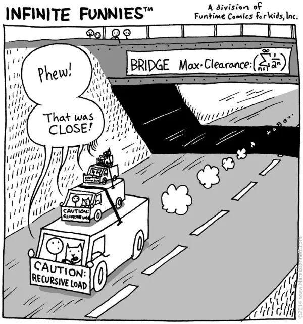

---

【代码】无限递归

```js
function tell_story() {
    console.log("从前有座山");
    console.log("山里有座庙");
    console.log("庙里有个老和尚和小和尚");
    console.log("老和尚对小和尚在讲故事");
    console.log("他讲的故事是：");
    tell_story();
}

tell_story();
```

> 运行结果

```
从前有座山
山里有座庙
庙里有个老和尚和小和尚
老和尚对小和尚在讲故事
他讲的故事是：
从前有座山
山里有座庙
庙里有个老和尚和小和尚
老和尚对小和尚在讲故事
他讲的故事是：
...
```

---

递归函数一般需要定义递归的出口，即结束条件，确保递归能够在适合的地方退出。

---

【代码】阶乘

```js
function factorial(n) {
    if(n == 0 || n == 1) {
        return 1;
    }
    return n * factorial(n - 1);
}

console.log("5! = " + factorial(5));
```

> 运行结果

```
5! = 120
```


---

【代码】斐波那契数列（递归）

```js
function fibonacci(n) {
    if(n == 1 || n == 2) {
        return 1;
    }
    return fibonacci(n - 2) + fibonacci(n - 1);
}

n = 7;
console.log("斐波那契数列第" + n + "位：" + fibonacci(7));
```

> 运行结果

```
斐波那契数列第7位：13
```


---

【代码】斐波那契数列（迭代）

```js
function fibonacci(n) {
    var f = new Array(n + 1);
    f[1] = f[2] = 1;
    for(var i = 3; i <= n; i++) {
        f[i] = f[i - 2] + f[i - 1];
    }
    return f[n];
}

n = 7;
console.log("斐波那契数列第" + n + "位：" + fibonacci(7));
```

> 运行结果

```
斐波那契数列第7位：13
```

---

【代码】阿克曼函数
$$
A(m, n) =
\begin{cases}
	n + 1 & m = 0 \\
	A(m-1, 1) & m > 0, n = 0 \\
	A(m-1, A(m, n-1)) & m > 0, n > 0 \\
\end{cases}
$$

```js
function A(m, n) {
    if(m == 0) {
        return n + 1;
    } else if(m > 0 && n == 0) {
        return A(m-1, 1);
    } else if(m > 0 && n > 0) {
        return A(m-1, A(m, n-1));
    }
}

console.log(A(3, 4));
```

> 运行结果

```
125
```

|  m\n  |      0      |         1         |         2         |            3            |         4         |                           n                            |
| :---: | :---------: | :---------------: | :---------------: | :---------------------: | :---------------: | :----------------------------------------------------: |
| **0** |      1      |         2         |         3         |            4            |         5         |                       $ n + 1 $                        |
| **1** |      2      |         3         |         4         |            5            |         6         |                  $ 2 + (n + 3) - 3 $                   |
| **2** |      3      |         5         |         7         |            9            |        11         |                    $ 2(n + 3) - 3 $                    |
| **3** |      5      |        13         |        29         |           61            |        125        |                   $ 2^{n + 3} - 3 $                    |
| **4** |     13      |       65533       | $ 2^{65536} - 3 $ | $ A(3, 2^{65536} - 3) $ | $ A(3, A(4, 3)) $ | $ \underbrace{2^{2^{.^{.^{.{^2}}}}}}_{n+3\ twos} - 3 $ |
| **5** |    65533    |  $ A(4, 65533) $  | $ A(4, A(5, 1)) $ |    $ A(4, A(5, 2)) $    | $ A(4, A(5, 3)) $ |                       $ \dots $                        |
| **6** | $ A(5, 1) $ | $ A(5, A(5, 1)) $ | $ A(5, A(6, 1)) $ |    $ A(5, A(6, 2)) $    | $ A(5, A(6, 3)) $ |                       $ \dots $                        |


---

【代码】汉诺塔

给定三根柱子，其中A柱子从大到小套有n个圆盘，问题是如何借助B柱子，将圆盘从A搬到C。

> 规则：
>
> - 一次只能搬动一个圆盘
> - 不能将大圆盘放在小圆盘上面

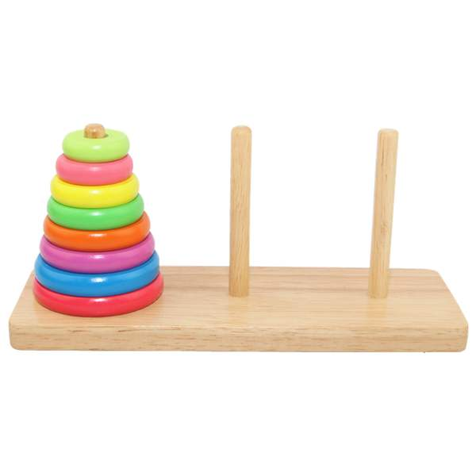

递归算法求解汉诺塔问题：

1. 将前n-1个圆盘从A柱借助于C柱搬到B柱。
2. 将最后一个圆盘直接从A柱搬到C柱。
3. 将n-1个圆盘从B柱借助于A柱搬到C柱。

```js
var move = 0;       // 移动次数

/**
 * @brief  汉诺塔算法
 * @note   把 n 个盘子从 src 借助 mid 移到 dst
 * @param  n: 层数
 * @param  src: 起点柱子
 * @param  mid: 临时柱子
 * @param  dst: 目标柱子
 */
function hanoi(n, src, mid, dst) {
    if(n == 1) {
        console.log(n + "号盘：" + src + " -> " + dst);
        move++;
    } else {
        // 把前 n-1 个盘子从 src 借助 dst 移到 mid
        hanoi(n-1, src, dst, mid);
        // 移动第 n 个盘子
        console.log(n + "号盘：" + src + " -> " + dst);
        move++;
        // 把刚才的 n-1 个盘子从 mid 借助 src 移到 dst
        hanoi(n-1, mid, src, dst);
    }
}

hanoi(4, 'A', 'B', 'C');
console.log("步数 ==> " + move);
```

> 运行结果

```
1号盘：A -> B
2号盘：A -> C
1号盘：B -> C
3号盘：A -> B
1号盘：C -> A
2号盘：C -> B
1号盘：A -> B
4号盘：A -> C
1号盘：B -> C
2号盘：B -> A
1号盘：C -> A
3号盘：B -> C
1号盘：A -> B
2号盘：A -> C
1号盘：B -> C
步数 ==> 15
```

---

<div style="page-break-after: always;"></div>

# 第15章 事件

## 15.1 事件

**事件（Event）**

JS创建动态页面时，事件是可以被JS侦测到的行为。网页中的每个元素都可以产生某些可以出发JS函数或程序的事件。例如当用户单击或者提交表单数据时，就发生一个鼠标单击事件，需要浏览器做出处理，返回给用户一个结果。

| 事件        | 说明                 |
| :---------- | -------------------- |
| onclick     | 鼠标单击事件         |
| onmouseover | 鼠标经过事件         |
| onmouseout  | 鼠标移开事件         |
| onchange    | 文本框内容改变事件   |
| onselect    | 文本框内容被选中事件 |
| onfocus     | 光标聚集             |
| onblur      | 光标离开             |
| onload      | 网页导入             |
| onunload    | 关闭网页             |

<div style="page-break-after: always;"></div>

## 15.2 鼠标单击事件

**鼠标单击事件onclick**

当在网页上单击鼠标时，就会发生该事件，同时`onclick`事件调用的程序块就会被执行，`onclick`通常与按钮一起使用。


---

【代码】onclick

```html
<!DOCTYPE html>
<html lang="en">
<head>
    <meta charset="UTF-8">
    <title>鼠标单击事件onclick</title>
    <script type="text/JavaScript">
        var cnt = 0;
        function feedback() {
            cnt++;
            console.log("我被点击了"+ cnt + "次");
        }
    </script>
</head>
<body>
    <form action="get/post">
        <input type="button" value="点击" onclick="feedback();">
    </form>
</body>
</html>
```

---

<div style="page-break-after: always;"></div>

## 15.3 鼠标经过/移开事件

**鼠标经过事件onmouseover**

当鼠标移到一个对象上时，该对象就会触发`onmouseover`事件，并执行`onmouseover`事件调用的程序。


---

【代码】onmouseover

```html
<!DOCTYPE html>
<html lang="en">
<head>
    <meta charset="UTF-8">
    <title>鼠标经过事件onmouseover</title>
    <script type="text/JavaScript">
        function feedback() {
            alert("卸载之前再想想吧...");
        }
    </script>
</head>
<body>
    <form action="get/post">
        <input type="button" value="卸载" 
            onmouseover="feedback();">
    </form>
</body>
</html>
```

---


**鼠标移开事件onmouseout**

当鼠标移开当前对象时，执行`onmouseout`事件调用的程序。

---

【代码】onmouseout

```html
<!DOCTYPE html>
<!DOCTYPE html>
<html lang="en">
<head>
    <meta charset="UTF-8">
    <title>鼠标移开事件onmouseout</title>
    <script type="text/JavaScript">
        function feedback() {
            alert("不要离开！只要输入密码，再点击登录就OK啦！");
        }
    </script>
</head>
<body>
    <form action="get/post">
        密码：<input type="password"
                onmouseout="feedback();">
        <input type="button" value="登录">
    </form>
</body>
</html>
```

---

<div style="page-break-after: always;"></div>

## 15.4 光标聚焦/失焦事件

**光标聚焦事件onfocus**

当网页中的对象获得聚点时，执行`onfocus`事件调用的程序。

---

【代码】onfocus

```html
<!DOCTYPE html>
<html lang="en">
<head>
    <meta charset="UTF-8">
    <title>光标聚焦事件onfocus</title>
    <script type="text/JavaScript">
        var flag = true;
        function feedback() {
            if(flag) {
                alert("不要填错啦！");
                flag = false;
            }
        }
    </script>
</head>
<body>
    <form action="get/post">
        密码：<input type="password"
                onfocus="feedback();">
        <input type="button" value="登录">
    </form>
</body>
</html>
```

---


**失焦事件onblur**

`onblur`事件与`onfocus`事件是相对事件，当光标离开当前获得聚焦对象的时候，就会触发`onblur`事件，同时执行被调用的程序。

---

【代码】onblur

```html
<!DOCTYPE html>
<html lang="en">
<head>
    <meta charset="UTF-8">
    <title>失焦事件onblur</title>
    <script type="text/JavaScript">
        function feedback() {
            alert("确定输对了再点登录哟！");
        }
    </script>
</head>
<body>
    <form action="get/post">
        密码：<input type="password"
                onblur="feedback();">
        <input type="button" value="登录">
    </form>
</body>
</html>
```

---

<div style="page-break-after: always;"></div>

## 15.5 内容选中/改变事件

**内容选中事件onselect**

当文本框或者文本域中的文本被选中时，触发`onselect`事件，同时调用的程序就会被执行。

---

【代码】onselect

```html
<!DOCTYPE html>
<html lang="en">
<head>
    <meta charset="UTF-8">
    <title>内容选中事件onselect</title>
    <script type="text/JavaScript">
        function feedback() {
            console.log("文本内容被选中");
        }
    </script>
</head>
<body>
    <form action="get/post">
        <textarea rows="10" cols="30" onselect="feedback();">填写个人信息，不少于20个字。</textarea>
    </form>
</body>
</html>
```

---


**内容改变事件onchange**

通过改变文本框的内容可以触发`onchange`事件，同时执行被调用的程序。

---

【代码】onchange

```html
<!DOCTYPE html>
<html lang="en">
<head>
    <meta charset="UTF-8">
    <title>内容改变事件onchange</title>
    <script type="text/JavaScript">
        function feedback() {
            console.log("文本内容被修改");
        }
    </script>
</head>
<body>
    <form action="get/post">
        <textarea rows="10" cols="30" onchange="feedback();">填写个人信息，不少于20个字。</textarea>
    </form>
</body>
</html>
```

---

<div style="page-break-after: always;"></div>

## 15.6 加载/卸载事件

**加载事件onload**

加载事件会在页面加载完成后立即发生，同时执行被调用的程序。注意，加载事件需要写在`<body>`标签内。


---

【代码】onload

```html
<!DOCTYPE html>
<html lang="en">
<head>
    <meta charset="UTF-8">
    <title>加载事件onload</title>
    <script type="text/JavaScript">
        function feedback() {
            alert("页面加载完成");
        }
    </script>
</head>
<body onload="feedback();">
    <p>Hello World!</p>
</body>
</html>
```

---


**卸载事件onunload**

当用户退出页面时（页面关闭、页面刷新等），就会触发`onunload`事件，同时执行被调用的程序。注意，不同浏览器对`onunload`事件的支持不同。

<div style="page-break-after: always;"></div>

# 第16章 对象

## 16.1 对象

**对象（Object）**

JS中的所有事物都是对象，如字符串、数值、数组、函数等，每个对象带有属性和方法。对象的属性反映了该对象的某些特定性质，如字符串的长度、图像的长宽等，对象的方法指的是能够在对象上执行的动作，如表单的提交、时间的获取等。

JS提供了多个内建对象，如`String`、`Date`、`Array`等，使用对象前需要先使用`new`关键字进行定义。

---

【代码】访问对象属性

```js
var arr = new Array(1, 2, 3, 4, 5);
console.log(arr.length);
```

> 运行结果

```
5
```

---

【代码】访问对象方法

```js
var str = "Hello World";
console.log(str.toUpperCase());
```

> 运行结果

```
HELLO WORLD
```

---

<div style="page-break-after: always;"></div>

## 16.2 Date

**Date**

Date对象可以存储任意一个日期，并且可以精确到毫秒数（$ 1 / 1000 $秒）。使用默认构造函数创建的日期对象有初始值，为当前电脑系统时间。

---

【代码】定义Date对象

```js
var date1 = new Date();
console.log(date1);

var date2 = new Date(2021, 3, 19);      //此处月份从0开始
console.log(date2);
```

> 运行结果

```
2021-03-19T05:09:47.713Z
2021-04-18T16:00:00.000Z
```

---

| 方法名称                      | 功能描述                           |
| ----------------------------- | ---------------------------------- |
| getDate() / setDate()         | 返回/设置日期                      |
| getFullYear() / setFullYear() | 返回/设置年份，用四位数表示        |
| getYear() / setYear()         | 返回/设置年份                      |
| getMonth() / setMonth()       | 返回/设置月份，月份从0开始         |
| getHours() / setHours()       | 返回/设置小时，24小时制            |
| getMinutes() / setMinutes()   | 返回/设置分钟数                    |
| getSeconds() / setSeconds()   | 返回/设置秒钟数                    |
| getTime() / setTime()         | 返回/设置时间（毫秒为单位）        |
| getDay()                      | 返回0-6的数字表示星期，0表示星期天 |

---

【代码】获取今日星期

```js
var date = new Date();
var weekday = [
    "星期天", 
    "星期一", 
    "星期二", 
    "星期三", 
    "星期四", 
    "星期五", 
    "星期六"
];
console.log("今天是" + weekday[date.getDay()]);
```

> 运行结果

```
今天是星期五
```

---

<div style="page-break-after: always;"></div>

## 16.3 String

**String**

定义`String`对象后就可以访问它的属性和方法。

---

【代码】计算字符串长度

```js
var str = "Hello World!"
console.log(str.length);
```

> 运行结果

```
12
```

---


**大小写转换**

使用String对象的`toUpperCase()`和`toLowerCase()`方法可以将字符串进行大小写字母转换。

---

【代码】大小写字母转换

```js
var str = "Hello World!"
console.log(str.toUpperCase());
console.log(str.toLowerCase());
```

> 运行结果

```
HELLO WORLD!
hello world!
```

---


**返回指定的字符**

使用`charAt()`方法可返回指定位置的字符，返回的字符是长度为1的字符串。

```js
stringObj.charAt(index);
```

字符串第一个字符的下标是`0`，最后一个字符的下标为`length - 1`，如果参数`index`不在`0`与`length - 1`之间，该方法将返回一个空字符串。

---

【代码】charAt()

```js
var str = "Hello World!"
console.log(str.charAt(6));
```

> 运行结果

```
W
```

---


**返回指定的字符串首次出现的位置**

`indexOf()`方法可以返回某个指定的字符串值在字符串中首次出现的位置。

```js
stringObj.indexOf(substring, startPos);
```

该方法将从头到尾地检索字符串，检查是否含有需检索的子串。参数`startPos`为可选参数，用于规定开始查找的位置，如果没有设置此参数将从头开始查找。如果找到了子串，在返回子串的第一次出现位置。如果要检索的字符串值没有出现，则该方法返回`-1`。

---

【代码】indexOf()

```js
var str = "Hello World!";
console.log(str.indexOf("Hell"));
console.log(str.indexOf("o", 6));
console.log(str.indexOf("JS"));
```

> 运行结果

```
0
7
-1
```

---


**字符串分割**

`split()`方法可以将字符串分割为字符串数组，并返回此数组。

```js
stringObj.split(separator, limit);
```

其中参数`separator`必选，用于指定将字符串按某个字符切割成若干个子字符串，并以数组的形式返回。参数`limit`可选，用于指定分隔的次数。

如果把空字符串作为`separator`，那么字符串的每个字符之间都会被分隔。

---

【代码】split()

```js
var str = "hello HTML hello CSS hello JavaScript";
console.log(str.split(" "));
console.log(str.split(" ", 4));
```

> 运行结果

```
["hello", "HTML", "hello", "CSS", "hello", "JavaScript"]
["hello", "HTML", "hello", "CSS"]
```

---


**提取字符串**

`substring()`方法用于提取字符串中介于两个指定下标之间的字符。

```js
stringObj.substring(startPos, stopPos);
```

该方法返回的内容是从`startPos`开始到`stopPos - 1`处的所有内容，其长度为`stopPos - startPos`。如果`startPos`和`stopPos`相等，那么返回的就是一个空串（长度为`0`的字符串）。如果`startPos`比`stopPos`大，那么该方法在提取子串之间会先交换这两个参数。

---

【代码】substring()

```js
var str = "HelloWorld";
console.log(str.substring(2, 8));
console.log(str.substring(3, 3));
console.log(str.substring(7, 3));
```

> 运行结果

```
lloWor

loWo
```

---


**提取指定数目的字符**

`substr()`方法用于从字符串中提取从`startPos`位置开始的指定数目的字符串。

```js
stringObj.substr(startPos, length);
```

如果参数`startPos`是负数，则从字符串的尾部开始算起，如果`startPos`为负数且绝对值大于字符串长度，则`startPos`会被视为`0`。

---

【代码】substr()

```js
var str = "HelloWorld";
console.log(str.substr(2, 3));
console.log(str.substr(-5, 4));
```

> 运行结果

```
llo
Worl
```

---

<div style="page-break-after: always;"></div>

## 16.4 Math

**Math**

`Math`对象提供对数据的数学计算。需要注意的是，`Math`对象是一个固有的对象，无需创建它，直接把`Math`作为对象使用就可以调用其所有属性和方法，这是它与其它对象的区别。

| 属性    | 说明                                                   |
| ------- | ------------------------------------------------------ |
| E       | 返回算术常量$ e $，即自然对数的底数（约等于$ 2.718 $） |
| LN2     | 返回$ 2 $的自然对数（约等于$ 0.693 $）                 |
| LN10    | 返回$ 10 $的自然对数（约等于$ 2.302 $）                |
| LOG2E   | 返回以$ 2 $为底$ e $的对数（约等于$ 1.442 $）          |
| LOG10E  | 返回以$ 10 $为底$ e $的对数（约等于$ 0.434 $）         |
| PI      | 返回圆周率（约等于$ 3.14159 $）                        |
| SQRT1_2 | 返回$ 2 $的平方根的倒数（约等于$ 0.707 $）             |
| SQRT2   | 返回$ 2 $的平方根（约等于$ 1.414 $）                   |


| 方法      | 描述                             |
| --------- | -------------------------------- |
| sin(x)    | 返回$ x $的正弦                  |
| cos(x)    | 返回$ x $的余弦                  |
| tan(x)    | 返回$ x $的正切                  |
| acos(x)   | 返回$ x $的反余弦值              |
| asin(x)   | 返回$ x $的反正弦值              |
| atan(x)   | 返回$ x $的反正切值              |
| ceil(x)   | 对$ x $进行上取整                |
| floor(x)  | 对$ x $进行下取整                |
| abs(x)    | 返回$ x $的绝对数                |
| exp(x)    | 返回$ e $的$ x $次幂             |
| log(x)    | 返回$ x $的自然对数（底为$ e $） |
| pow(x, y) | 返回$ x $的$ y $次幂             |
| max(x, y) | 返回$ x $和$ y $中的最大值       |
| min(x, y) | 返回$ x $和$ y $中的最小值       |
| round(x)  | 返回$ x $的四舍五入最接近的整数  |
| sqrt(x)   | 返回$ x $的平方根                |
| random()  | 返回$ 0 - 1 $之间的随机数        |

<div style="page-break-after: always;"></div>

# 第17章 浏览器对象模型BOM

## 17.1 window对象

**window对象**

·window·对象是浏览器对象模型`BOM（Browser Object Model）`的核心。

| 方法            | 描述                                           |
| --------------- | ---------------------------------------------- |
| alert()         | 显示带有一段消息和一个确认按钮的警告框         |
| prompt()        | 显示可提示用户输入的对话框                     |
| confirm()       | 显示带有一段消息以及确认按钮和取消按钮的对话框 |
| open()          | 打开一个新的浏览器窗口或查找一个已命名的窗口   |
| close()         | 关闭浏览器窗口                                 |
| print()         | 打印当前窗口的内容                             |
| focus()         | 把键盘焦点给与一个窗口                         |
| blur()          | 把键盘焦点从顶层窗口移开                       |
| moveBy()        | 可相对窗口的当前坐标把它移动指定的像素         |
| moveTo()        | 把窗口的左上角移动到一个指定的坐标             |
| resizeBy()      | 按照指定的像素调整窗口的大小                   |
| resizeTo()      | 把窗口的大小调整到指定的宽度和高度             |
| scrollBy()      | 按照指定的像素值来滚动内容                     |
| scrollTo()      | 把内容滚动到指定的坐标                         |
| setInterval()   | 每隔指定的时间执行代码                         |
| setTimeout()    | 在指定的延迟时间之后来执行代码                 |
| clearInterval() | 取消`setInterval()`的设置                      |
| clearTimeout()  | 取消`setTimeout()`的设置                       |

<div style="page-break-after: always;"></div>

## 17.2 计时器

**计时器**

在JS中，可以在设定的时间间隔之后执行代码，而不是在函数被调用后立即执行。

计时器的类型分为2种：

1. 一次性计时器：仅在指定的延迟时间之后触发一次。
2. 间隔性触发计时器：每隔一定的时间间隔就触发一次。

| 方法            | 描述                           |
| --------------- | ------------------------------ |
| setTimeout()    | 在指定的延迟时间之后来执行代码 |
| clearTimeout()  | 取消`setTimeout()`的设置       |
| setInterval()   | 每隔指定的时间执行代码         |
| clearInterval() | 取消`setInterval()`的设置      |


**setTimeout()**

`setTimeout()`计时器，在载入后延迟指定时间后，去执行一次表达式，仅执行一次。

```js
setTimeout(expr, timeout);
```

> - expr：要调用的函数或要执行的代码串。
> - timeout：在执行代码前需等待的时间，以毫秒为单位（1s = 1000ms）。

---

【代码】setTimeout()计时器

```js
//网页打开2秒后弹出提示框
setTimeout("alert('Welcome')", 2000);
```

---

`clearTimeout()`和`setTimeout()`一起使用，用于停止计时器。

```js
clearTimeout(id_of_setTimeout);
```

> id_of_setTimeout：`setTimeout()`返回的ID值，该值标识要取消的延迟执行代码块。

---

【代码】计数器

- counter.html

```html
<!DOCTYPE html>
<html lang="en">
<head>
    <meta charset="UTF-8">
    <title>计数器</title>
    <script src="counter.js"></script>
</head>
<body>
    <form action="get/post">
        <input type="text" id="num">
        <input type="button" value="stop" onclick="stopCount();">
    </form>
</body>
</html>
```

- counter.js

```js
var cnt = 0;        // 计数
var counter;        // 计数器

/**
 * 每隔1000毫秒计数加1
 */
function count() {
    document.getElementById('num').value = cnt;
    cnt++;
    counter = setTimeout(count, 1000);
}

/**
 * 停止计数器
 */
function stopCount() {
    clearTimeout(counter);
}

setTimeout(count, 1000);        // 启动计数器
```

---


**setInterval()**

`setInterval()`在执行时，从载入页面后每隔指定的时间执行代码。

```js
setInterval(expr, interval);
```

> - expr：要调用的函数或要执行的代码串。
> - interval：周期性执行或调用表达式之间的时间间隔，以毫秒为单位（1s = 1000ms）。

`clearInterval()`方法可取消由`setInterval()`设置的交互时间。

```js
clearInterval(id_of_setInterval);
```

> id_of_setInterval：`setInterval()`返回的ID值。

---

【代码】实时显示当前时间

- current_time.html

```html
<!DOCTYPE html>
<html lang="en">
<head>
    <meta charset="UTF-8">
    <title>显示当前时间</title>
    <script src="current_time.js"></script>
</head>
<body>
    <form action="get/post">
        <input type="text" id="time" size="50">
    </form>
</body>
</html>
```

- current_time.js

```js
// function clock() {
//     var date = new Date();
//     document.getElementById("time").value = date;
// }

// setInterval(clock, 1000);

// 箭头函数
setInterval(() => {
    var date = new Date();
    document.getElementById("time").value = date;
}, 1000);
```

---

<div style="page-break-after: always;"></div>

## 17.3 Screen对象

**Screen对象 **

`Screen`对象用于获取用户的屏幕信息。`window.screen`对象在编写时可以不使用`window`前缀。

```js
window.screen.属性;
```


| 属性        | 描述                                                         |
| ----------- | ------------------------------------------------------------ |
| availHeight | 窗口可以使用的屏幕高度，单位像素                             |
| availWidth  | 窗口可以使用的屏幕宽度，单位像素                             |
| colorDepth  | 用户浏览器表示的颜色位数，通常为32位（每像素的位数）         |
| pixelDepth  | 用户浏览器表示的颜色位数，通常为32位（每像素的位数），IE不支持此属性 |
| height      | 屏幕的高度，单位像素                                         |
| width       | 屏幕的宽度，单位像素                                         |

`screen.availWidth`和`screen.availHeight`属性返回访问者屏幕的宽度和高度，单位为像素，减去界面特性，比如任务栏等。不同系统的任务栏默认高度不一样，及任务栏的位置可在屏幕上下左右任何位置，所以有可能可用宽度和高度不一样。

---

【代码】屏幕信息

```html
<!DOCTYPE html>
<html lang="en">
<head>
    <meta charset="UTF-8">
    <title>屏幕信息</title>
    <script type="text/JavaScript">
        console.log("屏幕分辨率：" + screen.width + "*" + screen.height)
        console.log("屏幕可用宽高：" + screen.availWidth + "*" + screen.availHeight);
    </script>
</head>
<body>
    
</body>
</html>
```

> 运行结果

```
屏幕分辨率：1536*864
屏幕可用宽高：1536*824
```

---

<div style="page-break-after: always;"></div>

# 第18章 文档对象模型DOM

## 18.1 DOM

**DOM（Document Object Model）**

文档对象模型`DOM`定义访问和处理HTML文档的标准方法，`DOM`将HTML文档呈现为带有元素、属性和文本的树结构（结点树）。

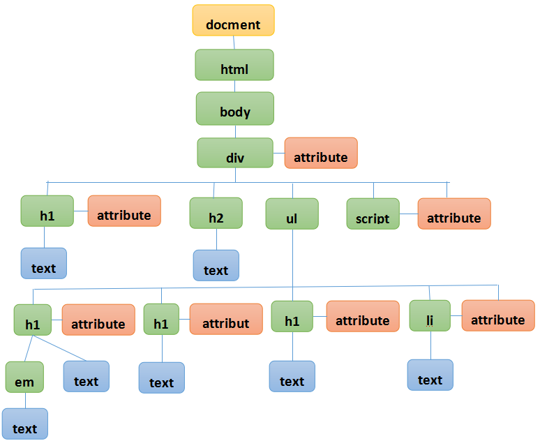

<div style="page-break-after: always;"></div>

## 18.2 获取结点对象

**getElementById()**

`getElementById()`方法可返回拥有指定ID的第一个对象的引用。

```js
document.getElementById(elementID);
```

如果没有指定ID的元素则返回`null`，如果存在多个指定ID的元素则返回第一个。

---

【代码】定时变换颜色

- random_color.html

```html
<!DOCTYPE html>
<html lang="en">
<head>
    <meta charset="UTF-8">
    <title>随机颜色</title>
    <script src="random_color.js"></script>
</head>
<body>
    <div id="square" style="width: 100px; height: 100px"></div>
</body>
</html>
```

- random_color.js

```js
/**
 * 随机生成RGB颜色代码
 * @returns rgb颜色
 */
function randomRGB() {
    var r = Math.floor(Math.random() * 256);
    var g = Math.floor(Math.random() * 256);
    var b = Math.floor(Math.random() * 256);
    return "rgb(" + r + ", " + g + ", " + b + ")";
}

/**
 * 获取元素结点，设置背景颜色
 */
function changeColor() {
    var obj = document.getElementById("square");
    obj.style.background = randomRGB();
}

// 每隔300ms改变颜色
setInterval(function () {
    changeColor();
}, 300);
```

---


**getElementsByClassName()**

`getElementByClassName()`方法返回文档中所有指定类名的元素集合，作为`NodeList`对象。`NodeList`对象代表一个有顺序的结点列表，可以通过索引来访问列表中的结点。使用`NodeList`的`length`属性可以确定指定类名的元素个数，并循环各个元素来获取某个元素。

```js
document.getElementsByClassName(className);
```


**getElementByName()**

`getElementByName()`方法返回带有指定名称的结点对象的集合。

```js
document.getElementsByName(name);
```

与`getElementById()`方法不同的是，通过元素的`name`属性查询元素，而不是通过`id`属性。文档中的`name`属性可能不唯一，所以`getElementByName()`方法返回的是元素的数组，而不是一个元素。


**getElementsByTagName()**

`getElementsByTagName()`方法返回带有指定标签名的结点对象的集合，返回元素的顺序是它们在文档中的顺序。

```js
document.getElementsByTagName(tagName);
```

<div style="page-break-after: always;"></div>

## 18.3 结点属性

**结点属性**

`getAttribute()`方法可以通过元素结点的属性名称获取属性的值。

```js
elementNode.getAttribute(name);
```

其中，`elementNode`可以使用`getElementById()`、`getElementsByTagName()`等方法获取到元素结点，参数`name`为需要查询的元素结点的属性名称。

`setAttribute()`方法可以增加一个指定名称和值的新属性，或者把一个现有的属性设定为指定的值。

```js
elementNode.setAttribute(name, value);
```

> - name：设置的属性名。
> - value：设置的属性值。

---

【代码】设置结点属性值

- getAttribute.html

```html
<!DOCTYPE html>
<html lang="en">
<head>
    <meta charset="UTF-8">
    <title>设置结点属性</title>
    <script src="getAttribute.js"></script>
</head>
<body>
    <a class="link" href="https://www.baidu.com">百度</a>
    <a class="link" href="https://www.bilibili.com">哔哩哔哩</a>
</body>
</html>
```

- getAttribute.js

```js
window.onload = function() {
    var links = document.getElementsByClassName("link");
    for(var i = 0; i < links.length; i++) {
        console.log(links[i].getAttribute("href"));
        links[i].setAttribute("target", "_blank");
    }
};
```

> 运行结果

```
https://www.baidu.com
https://www.bilibili.com
```

---

<div style="page-break-after: always;"></div>

## 18.4 结点操作

**结点操作**

- `createElement()`：创建结点元素，此方法可返回一个`Element`对象。要与`appendChild()`或`insertBefore()`方法联合使用，将元素显示在页面中。

```js
document.createElement(tagName);
```

- `appendChild()`：在指定结点的最后一个子结点列表之后添加一个新的子结点。

```js
elementNode.appendChild(newNode);
```

- `insertBefore()`：在已有的子结点前插入一个新的子结点。

```js
elementNode.insertBefore(newNode, node);
```

- `removeChild()`：从子结点列表中删除某个结点，如删除成功返回被删除的结点，如失败则返回`null`。

```js
elementNode.removeChild(node);
```

- `replaceChild()`：实现子结点的替换，返回被替换对象的引用。当`oldNode`被替换时，所有与之相关的属性内容都将被移出。

```js
elementNode.replaceChild(newNode, oldNode);
```

